# 教材プリントメーカー の使い方

このページは、手元の PDF を読みこんで、その上に書きこみ、児童生徒の端末へ配ったり紙に印刷したりするための Web アプリ「教材プリントメーカー」の使い方です。画面の写真と見くらべながら、上から順にお読みください。

本アプリは、学校教育法第34条第2項に定める「学習者用デジタル教科書」ではありません。教科書発行者とは関係のない、個人が作成した教材ビューアです。公開しているアドレス（`digital-textbook.giga-school.com`）とリポジトリの名前は、作りはじめたころの経緯からそのまま残っていますが、画面に出る名前は「教材プリントメーカー」です。

## 「教材プリントメーカー」でできること（はじめに）

先生がご自身で作ったプリントの PDF を読みこむと、その上にえんぴつ・マーカー・ふせん・スタンプで書きこめるようになります。書きこんだものは、そのまま電子黒板に大きく映したり、紙に印刷したり、児童生徒の端末へ配ったりできます。

会員登録もインストールも要りません。ブラウザで開けばすぐ使えます。読みこんだ PDF と書きこみは、すべて先生の端末の中（ブラウザの保存領域）にだけ残り、どこかのサーバーへ送られることはありません。

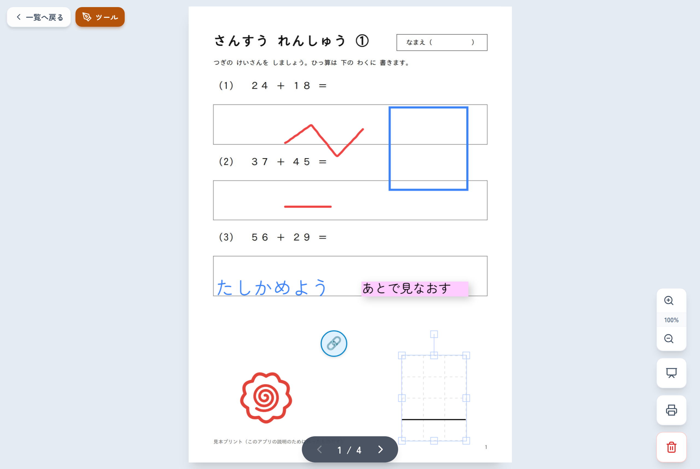

えんぴつ・ふせん・スタンプを置いた例です。

### 使うのは誰か、何がいるのか

この説明は先生に向けて書いています。児童生徒の端末で使うのは、先生から配られた教材を開くところ（この文書の「児童生徒の端末へ教材を配る」の章）だけです。

読みはじめる前に、次のものをお手元にご用意ください。

- インターネットにつながる端末（Chromebook、Windows、iPad、Android のいずれでも動きます）
- ブラウザ（Chrome、Edge、Safari のいずれか）
- 読みこみたい PDF ファイル（先生がご自身で作ったもの、または権利の処理が済んでいるもの）
- アプリのアドレス `https://digital-textbook.giga-school.com/`
- Google ドライブと同期する場合のみ、学校の Google アカウント（使わなければ不要です）

### 書きこみの保存について

書きこんだものは、手が止まるとすぐに自動で保存されます。「保存」ボタンはありません。タブを閉じるときや、ほかのアプリに切り替えたときにも、取りこぼさずに保存します。

ただし保存先はその端末の中だけです。端末を初期化したり、ブラウザの「閲覧データを削除」をしたりすると消えます。学期に一度はバックアップを取っておくことをおすすめします（「書きこみを守る」の章）。

## 読む前の準備と、最初に出る著作権の注意

はじめてアプリを開いたときだけ、取りこんでよい資料の範囲についての注意が出ます。ここを読んでいただくところから始まります。

### アプリを開いて、注意を読む

ブラウザのアドレス欄に `https://digital-textbook.giga-school.com/` と入れて開いてください。画面の中ほどに「使うときの注意」という白い窓が出ます。

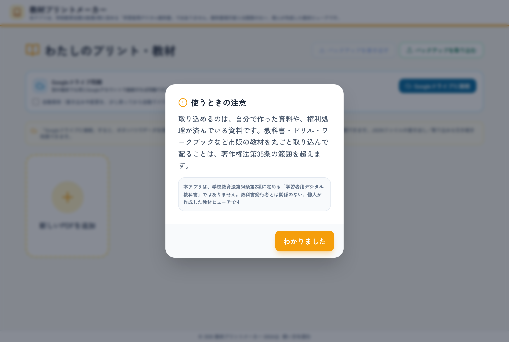

はじめて開いたときだけ出る画面です。

書かれているのは、取りこめるのは先生がご自身で作った資料や、権利の処理が済んでいる資料だということです。教科書・ドリル・ワークブックなど市販の教材を丸ごと取りこんで配ることは、著作権法第35条（学校その他の教育機関における複製等）の範囲を超えます。第35条には「著作権者の利益を不当に害することとなる場合は、この限りでない」という条件があり、1 冊まるごとの取りこみと配布はこれにあたります。

このアプリの共有機能は「先生の端末から児童生徒の端末へ配る」ためのものです。配ってよい資料かどうかの判断は、お使いになる先生の責任になります。

読み終えたら「わかりました」を押してください。次からは出ません。

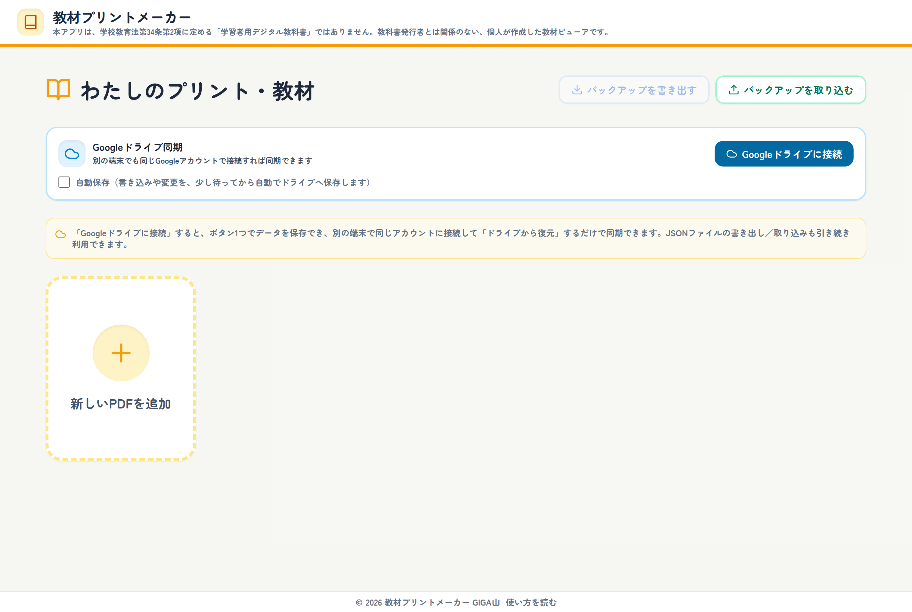

これが最初の画面「わたしのプリント・教材」です。

【！】覚えておいていただきたいこと:

- はじめて開くときだけ、インターネットにつながっている必要があります。一度開いておけば、次からはつながっていなくても起動します。授業の前日に一度開いておくと安心です。
- 「わかりました」を押したことはこの端末にだけ記録されます。別の端末や別のブラウザで開くと、もう一度出ます。
- 同じ内容は、このページの上のほうと、アプリの説明書きにも書いてあります。

## アプリとして端末に入れる（初回のみ）

ホーム画面やデスクトップに入れておくと、ブラウザを開かずにすぐ使えます。アドレス欄も消えるので、画面を広く使えます。この章の操作は 1 回だけで、ふだんの利用には要りません。

### Chromebook・Windows・Android の端末に入れる

Chrome が「このサイトはアプリとして入れられる」と判断すると、最初の画面の右上に「アプリを入れる」というオレンジ色のボタンが出ます。

入れる手順:

1. 最初の画面「わたしのプリント・教材」の右上を見てください。
2. 「アプリを入れる」を押してください。確認の小さな窓が出ます。
3. 「インストール」を選んでください。デスクトップやホーム画面にアイコンができます。

【！】覚えておいていただきたいこと:

- ボタンが出ないことがあります。ブラウザが判断してから出るので、開いた直後は出ません。数秒待ってみてください。
- すでにアプリとして開いているときは、このボタンは出ません。
- ボタンが出ないままでも、アドレス欄の右はしにある小さなアイコン（下向き矢印の付いた四角）から同じことができます。
- 入れなくてもアプリは同じように使えます。書きこんだものも共通です。

### iPad・iPhone に入れる（Safari）

iPad と iPhone には、上のようなボタンが出ません。ブラウザの側から入れていただきます。

入れる手順:

1. Safari でアプリを開いてください（Chrome ではなく Safari です）。
2. 画面の下（iPad は上）にある共有ボタン（四角に上向きの矢印が付いたマーク）を押してください。
3. メニューを下へスクロールして「ホーム画面に追加」を押してください。
4. 右上の「追加」を押してください。ホーム画面にアイコンができます。

【！！】最重要注意事項:

- iPad と iPhone をお使いの先生は、必ずこの操作をしてください。Safari には「7 日間使わなかったサイトのデータを消す」というしくみがあり、ホーム画面に追加していないと、長い休みのあとに書きこみが消えていることがあります。
- ホーム画面に追加しておくと、この対象から外れます。
- すでに書きこみがある状態で追加しても、書きこみは消えません。

## PDF を取りこんで教材にする・いらない教材を消す

最初の画面「わたしのプリント・教材」で、PDF を読みこんで教材にします。読みこんだ教材はこの画面に並び、押すと開きます。

### PDF を読みこむ

読みこみの手順:

1. 最初の画面の左上にある、点線で囲まれた「新しいPDFを追加」の四角を押してください。

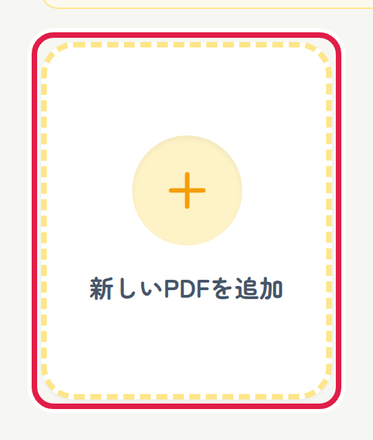

赤い枠で囲んだところを押します。

2. 端末の中から PDF ファイルを選んでください。
3. 「変換中...」と出ます。ページを 1 枚ずつ絵にしているところなので、そのままお待ちください。
4. 「PDFを読み込みました」と出て、その教材がそのまま開きます。

【！】覚えておいていただきたいこと:

- ファイル名から拡張子を除いたものが、そのまま教材の名前になります（`さんすうプリント.pdf` なら「さんすうプリント」）。あとから名前を変えることはできないので、読みこむ前にファイル名を整えておくと探しやすくなります。
- ページ数の多い PDF は時間がかかります。読みこみ中は画面を閉じないでください。
- パスワードのかかった PDF は読みこめません。「PDFの読み込みに失敗しました」と出ます。
- 300 ページを超えるような PDF は、メモリの少ない Chromebook で途中で止まることがあります。分けてから読みこんでください。

### 一覧から教材を開く

一覧へ戻ると、読みこんだ教材が表紙つきのカードで並びます。カードには教材の名前とページ数が出ます。

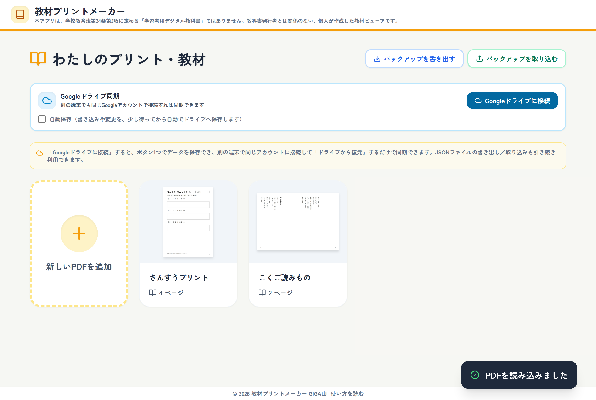

カードを押すと、その教材が開きます。

前に開いていた教材とページは覚えているので、次に開いたときはその続きから始まります。

### いらなくなった教材を消す

カードの表紙の右上に、ゴミ箱のマークが出ます（カードに触れると濃く出ます）。押すと確認の窓が出ます。

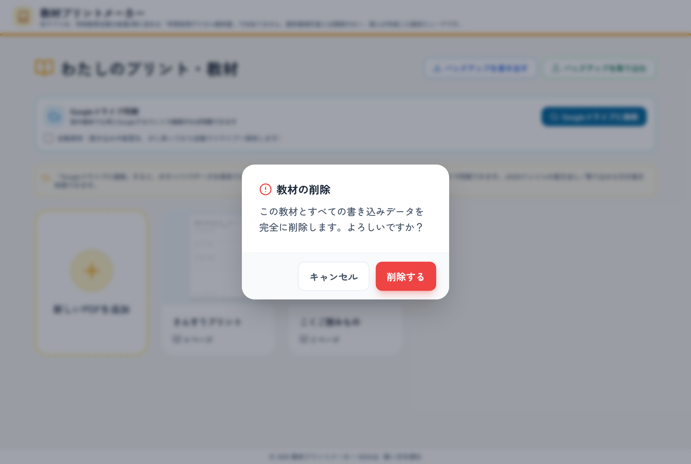

「削除する」を押すと消えます。

【！！】最重要注意事項:

- 消えるのは教材だけではありません。その教材に書きこんだ線・ふせん・スタンプも、すべて一緒に消えます。
- 元に戻すことはできません。「元に戻す」（Ctrl + Z）でも戻せません。
- 消す前に、バックアップを書き出しておくことをおすすめします（「書きこみを守る」の章）。
- 迷ったら「キャンセル」を押してください。何も起きません。

## 教材の画面の見かたと、ツールバーの出し入れ

教材を開くと、画面いっぱいがページになります。道具はふだん隠れていて、必要なときだけ呼び出す形です。ページを広く使うための作りです。

### 開いた直後の画面と、ツールバーの出しかた

開いた直後は、左上に「一覧へ戻る」と「ツール」の 2 つだけが出ています。

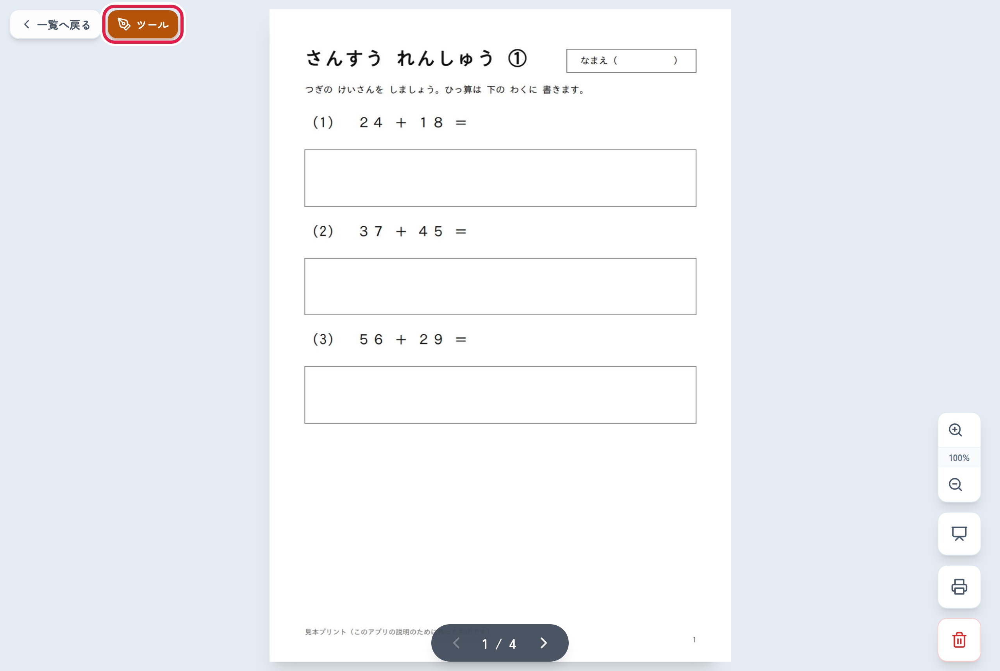

赤い枠の「ツール」を押すと道具が出ます。

「ツール」を押すと、道具のならんだバーが画面の上から下りてきます。使い終わったら、バーのいちばん右にある「隠す」でしまえます。

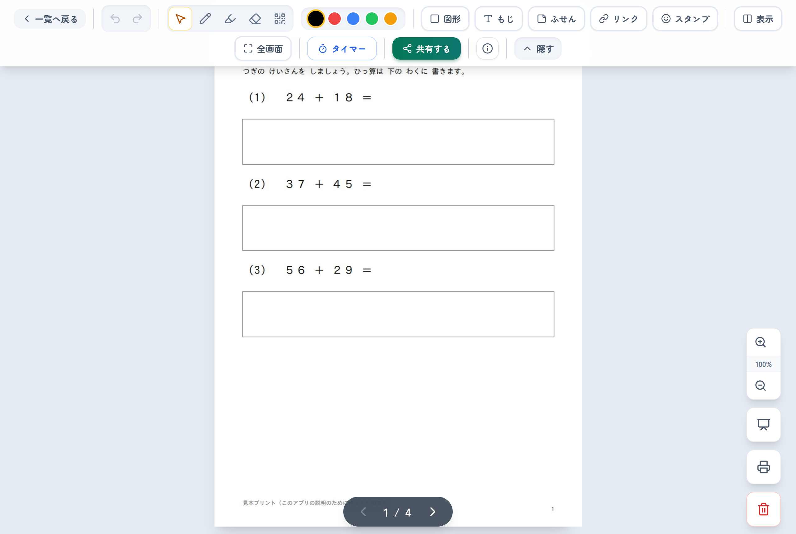

左から順に、戻す・書く道具・置く道具・見せかた・共有と並びます。

【！】覚えておいていただきたいこと:

- 教材を開いた直後は「選択」の状態です。いきなり線が引かれてしまわないための作りなので、書きこむときはまず道具を選んでください。
- ツールバーは、教材を開くたびに隠れた状態から始まります。
- 画面の幅が狭いと、ツールバーは 2 段に折り返して出ます。ボタンが減っているわけではありません。
- 「一覧へ戻る」を押すと、書きこみを保存してから一覧に戻ります。保存の操作は要りません。

### 書く道具と色の並び

ツールバーの左半分に、書くための道具がまとまっています。

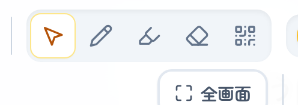

左から、戻す・やり直し・選択・えんぴつ・マーカー・けしごむ・QR 読み取り・色です。

それぞれの道具の使い方は、このあとの章で説明します。色は黒・赤・青・緑・オレンジの 5 色で、えんぴつ・マーカー・もじ・図形に共通で使われます。選んだ色は、次に選び直すまでそのままです。

## ページを送る・ページを指定して飛ぶ・大きさを変える

ページを行き来する道具は画面の下に、大きさを変える道具は画面の右下にあります。どちらもツールバーを隠していても使えます。

### 前後のページへ送る

画面の下の中央に、黒い横長のバーが出ています。

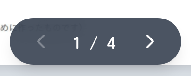

左右の矢印で 1 ページずつ送ります。まん中は「いま何ページめか」です。

送りかたは 3 通りあります。どれを使っても同じです。

- 画面下のバーの矢印を押す
- キーボードの右矢印キー・左矢印キーを押す
- 選択の状態のときに、教材の上を左右になぞる（スワイプする）

### ページ番号を押して、目当てのページへ飛ぶ

ページ数の多い教材では、1 ページずつ送るより速く着きます。

飛ばしかたの手順:

1. 画面下のバーのまん中にある「3 / 12」のような数字を押してください。
2. 数字を入れる小さな窓が出ます。

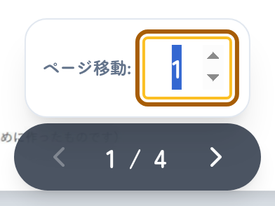

数字を入れて Enter を押すと、そのページへ飛びます。

3. 行きたいページの番号を入れて、Enter を押してください。

【！】覚えておいていただきたいこと:

- 教材にないページ番号を入れると「1 から ◯ の間で入力してください」と出ます。
- ページを移すと、拡大していた倍率は 100% に戻ります。
- ページを移すと、そのページの「元に戻す」の履歴は作り直されます。前のページの操作までさかのぼることはできません。

### 表示の大きさを変える

画面の右下に、道具が縦に並んでいます。

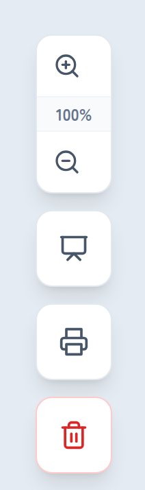

上から、拡大・倍率・縮小・提示モード・印刷・このページを消す、です。

いちばん上の虫めがねに＋の付いたボタンで大きく、その下の−の付いたボタンで小さくなります。あいだに出ている数字が、いまの倍率です。50% から 300% まで変わります。キーボードの上矢印キー・下矢印キーでも同じことができます。

端末を回したり、ウィンドウの大きさを変えたりすると、ページ全体が画面に収まる大きさに自動で合わせ直します。

## えんぴつ・マーカー・けしごむで書きこむ

ここからが書きこみです。道具を選んでから、教材の上をなぞってください。書いたものは自動で保存されます。

### えんぴつで手書きする

書きかたの手順:

1. ツールバーの、えんぴつのマークを押してください。
2. 色のならびから、使いたい色を押してください。
3. 教材の上をなぞってください。線が引かれます。

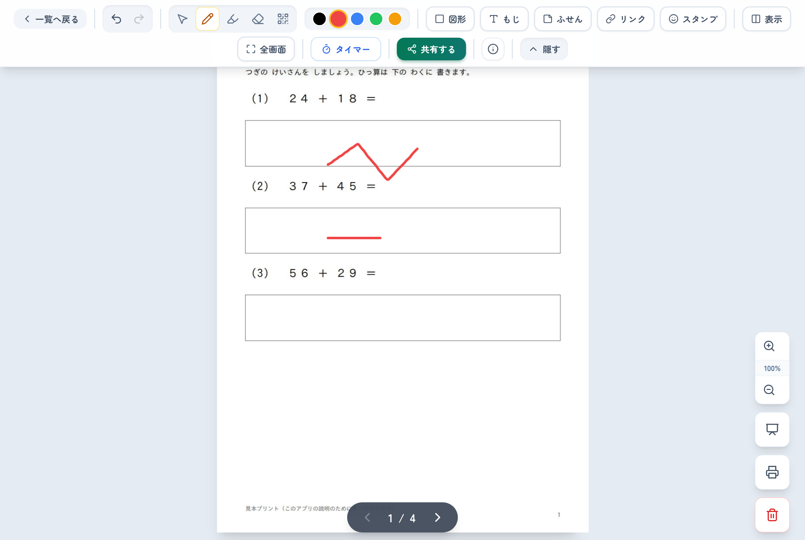

赤いえんぴつで書いた線です。

### マーカーで線を引く

マーカーは太さのある半透明の線です。下の文字が透けて見えるので、教科書の言葉をなぞるのに向いています。

引きかたの手順:

1. ツールバーの、マーカーのマークを押してください。
2. 色を選んでください。
3. なぞりたいところの上をなぞってください。

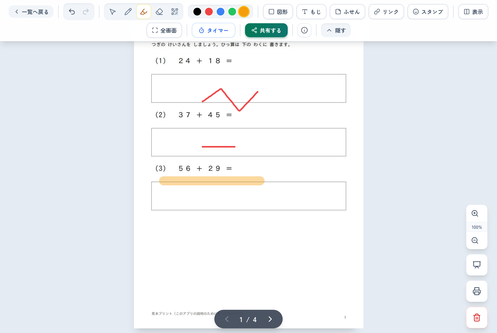

オレンジのマーカーで、問題の上をなぞりました。

### 書いたものを消す（けしごむ）

けしごむは、押したものを 1 つまるごと消す道具です。線の途中だけをこすって消すことはできません。

消しかたの手順:

1. ツールバーの、けしごむのマークを押してください。
2. 消したい線・ふせん・スタンプを押してください。それが丸ごと消えます。

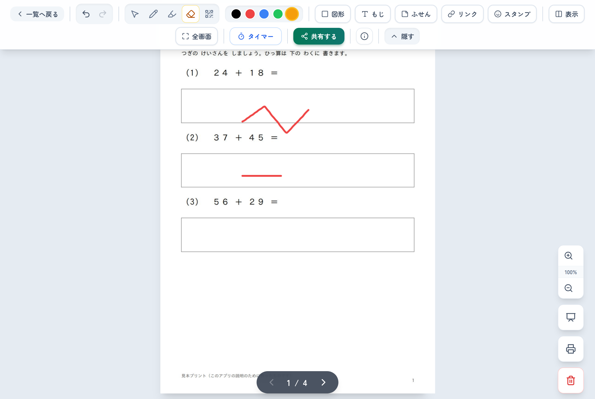

マーカーの線だけが消え、えんぴつの線は残っています。

【！】覚えておいていただきたいこと:

- 1 本の線・1 つのスタンプ・1 枚のふせんが、消える単位です。長い線を一部だけ短くすることはできません。
- 消しすぎたときは「元に戻す」（Ctrl + Z、Mac は ⌘ + Z）で戻せます。
- 選択の状態で対象を選び、Delete キーまたは BackSpace キーを押しても消せます。
- 書きこみの履歴は、そのページごとに 30 手ぶんまで覚えています。それより前の状態には戻せません。

### このページの書きこみを、まとめて消す

1 つずつ消すのではなく、いま開いているページの書きこみを全部消すこともできます。画面の右下にある、赤いゴミ箱のマークです。

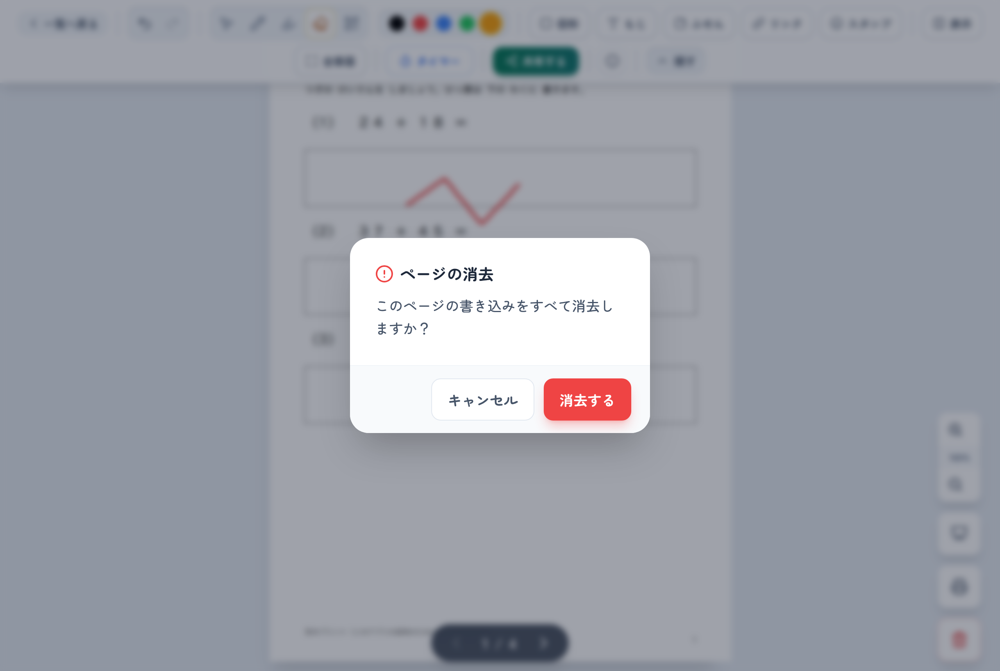

「消去する」を押すと、そのページの書きこみが全部消えます。

【！！】最重要注意事項:

- 消えるのは、いま開いている 1 ページの書きこみだけです。ほかのページや、ほかの教材には影響しません。
- 押した直後なら「元に戻す」（Ctrl + Z）で戻せますが、ページを移したり教材を閉じたりすると戻せなくなります。
- 迷ったら「キャンセル」を押してください。

## 図形・もじ・ふせん・リンクをページに置く

手書き以外に、形の決まったものを置けます。置いたものは、選択の状態でドラッグすると動かせますし、四隅をつまむと大きさと向きを変えられます。

### 四角・丸・直線・矢印を描く

ツールバーの「図形」を押すと、4 つのマークが出ます。

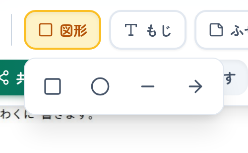

左から、四角・丸・直線・矢印です。

描きかたの手順:

1. 「図形」を押して、描きたい形を選んでください。
2. 色のならびから色を選んでください。
3. 教材の上を、描きたい大きさにドラッグしてください。ドラッグした大きさで描かれます。

### 文字を打ちこむ

ツールバーの「もじ」を押すと、ページの中央に文字が置かれ、そのまま打ちこめる状態になります。

打ちかたの手順:

1. ツールバーの「もじ」を押してください。
2. そのまま文字を打ってください。最初から入っている文字は、打ちはじめると置きかわります。
3. 打ち終わったら Esc キーを押すか、ページの別のところを押してください。

あとから直したいときは、選択の状態でその文字をダブルクリックすると、また打てるようになります。

### ふせんを貼る

ふせんは 4 色あります。ツールバーの「ふせん」を押すと、色が出ます。

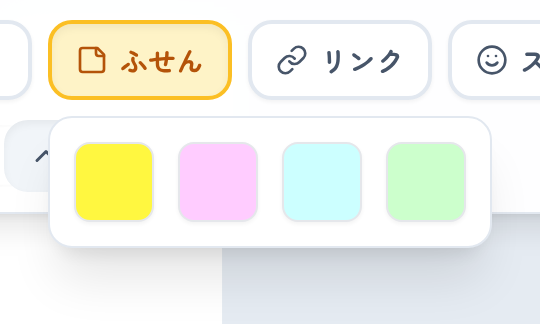

左から、黄・ピンク・水色・黄緑です。

貼りかたの手順:

1. ツールバーの「ふせん」を押してください。
2. 色を押してください。ページの中央にふせんが置かれ、そのまま打てる状態になります。
3. 文字を打って、Esc キーを押してください。

### Web ページや音声のボタンを置く

ページの上に丸いボタンを置いて、ダブルクリックで Web ページを開いたり、音を鳴らしたりできます。

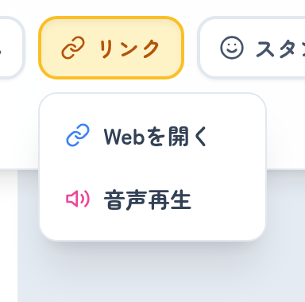

「Webを開く」と「音声再生」の 2 つから選びます。

置きかたの手順:

1. ツールバーの「リンク」を押してください。
2. 「Webを開く」か「音声再生」を選んでください。
3. ブラウザの入力窓が出るので、アドレス（URL）を貼りつけて「OK」を押してください。
4. ページの中央に丸いボタンが置かれます。青が Web ページ、ピンクが音声です。

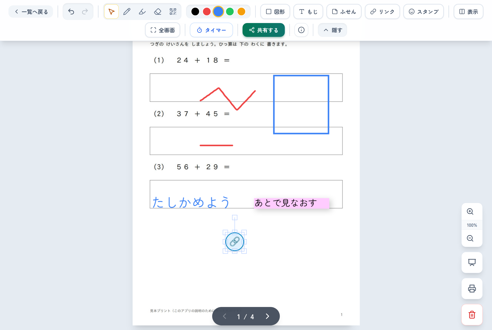

図形・もじ・ふせん・リンクを置いたところです。

【！】覚えておいていただきたいこと:

- 開く・鳴らすのはダブルクリックです。1 回押しただけでは選択されるだけで、何も起きません。
- 音声は「インターネット上にある音声ファイルのアドレス」を指すしくみです。端末の中の音声ファイルをドラッグして入れることはできません。
- `https://` や `http://` を付けずに入れた場合は、`https://` を頭に足して扱います。
- 置いたものはすべて、選択の状態でドラッグして動かせます。四隅の丸をつまむと大きさが変わります。

## スタンプを押す・自分のスタンプを作る

評価の朱印から算数の図形まで、167 種類のスタンプが入っています。押すとページの中央に置かれるので、そこから動かして使います。

### 用意されているスタンプを押す

ツールバーの「スタンプ」を押すと、スタンプのならんだパネルが開きます。上にある帯がタブで、教科ごとに分かれています。

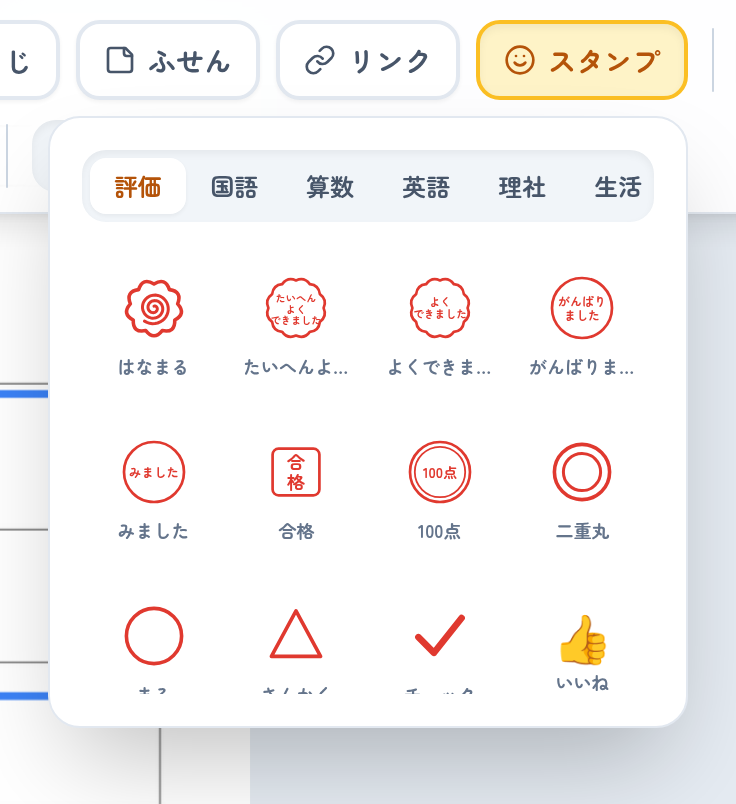

「評価」のタブ。はなまる、朱印、100点などが並びます。

タブは 7 つあります。評価が 16 種、国語が 41 種、算数が 42 種、英語が 10 種、理社が 34 種、生活が 24 種、そして自分で作った「マイ」です。タブの帯は横に流れるので、右のほうにあるタブは帯を左へなぞると出てきます。

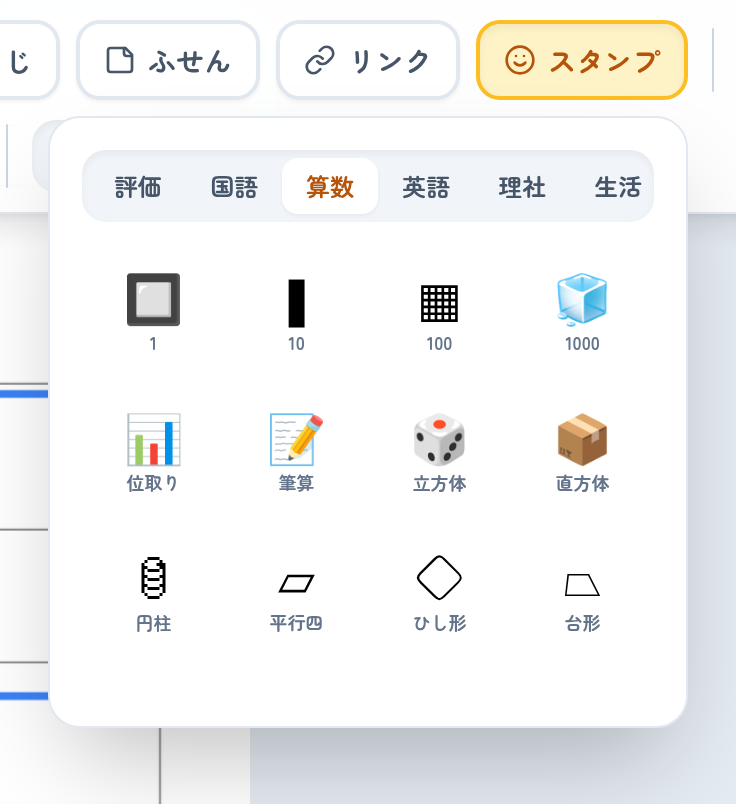

「算数」のタブ。位取り表、筆算のわく、立体図形などがあります。

押しかたの手順:

1. ツールバーの「スタンプ」を押してください。
2. 使いたい教科のタブを押してください。
3. スタンプを押してください。ページの中央に置かれます。
4. そのままドラッグして、置きたいところへ動かしてください。

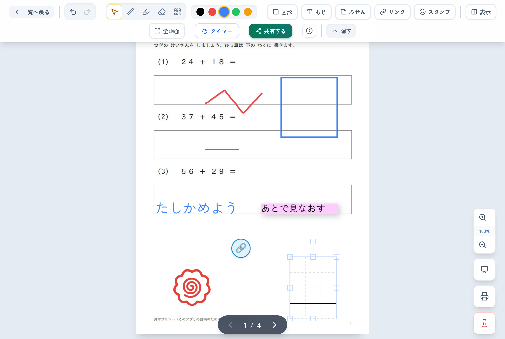

筆算のわくと、はなまるを置いたところです。

【！】覚えておいていただきたいこと:

- 押すと必ずページの中央に置かれます。押したい場所を先に選ぶことはできないので、置いてから動かしてください。
- 半ページ表示のときは、いま見えている側の中央に置かれます。
- 「分度器」や「三角定規」は絵柄としてのスタンプです。角度を測れる目盛りの付いた道具ではありません。
- 置いたスタンプは、四隅をつまんで大きさと向きを変えられます。

### 自分だけのスタンプを作る（マイスタンプ）

よく使う言葉は、自分のスタンプとして登録できます。作ったスタンプは「マイ」のタブに並びます。

作りかたの手順:

1. ツールバーの「スタンプ」を押して、タブの帯を左へなぞり、いちばん右の「マイ」を押してください。
2. 「新しいスタンプを作る」を押してください。

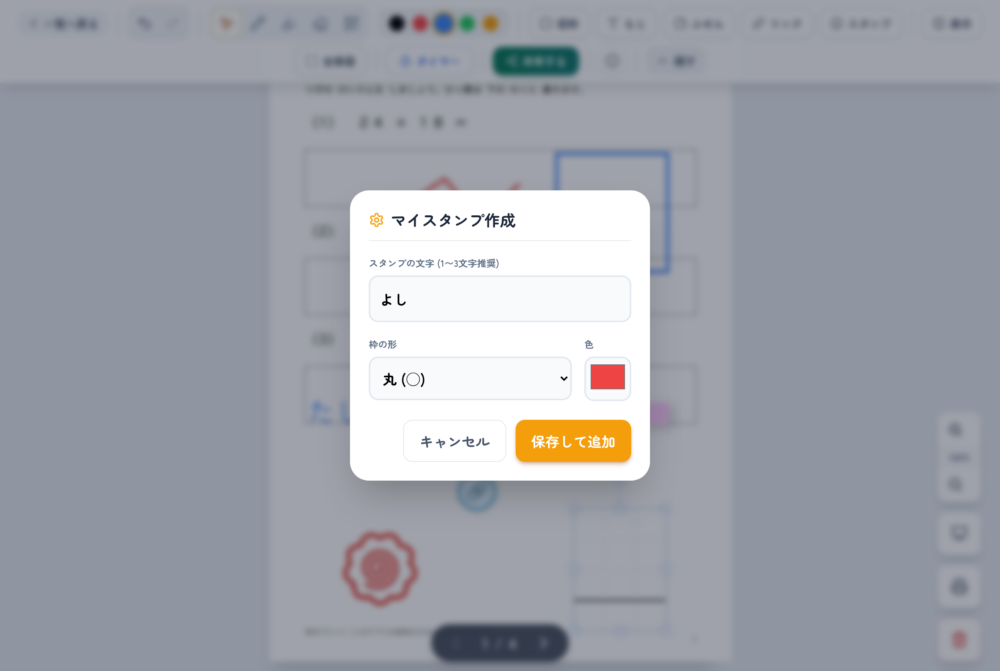

文字・枠の形・色の 3 つを決めます。

3. 「スタンプの文字」に入れる文字を打ってください。5 文字まで入りますが、1 文字から 3 文字が読みやすくおすすめです。
4. 「枠の形」を、枠なし・丸・四角から選んでください。
5. 「色」の四角を押して、好きな色を選んでください。
6. 「保存して追加」を押してください。

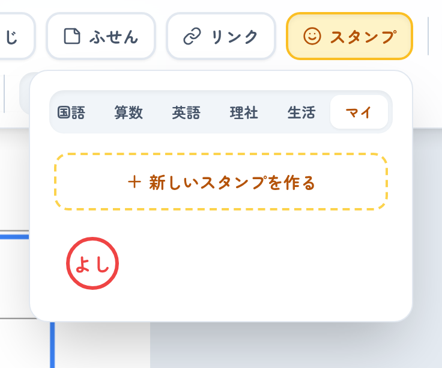

作ったスタンプが「マイ」のタブに並びます。

【！】覚えておいていただきたいこと:

- 作ったスタンプは、そのスタンプの右上に出る × で消せます。
- マイスタンプはこの端末に保存されます。バックアップにも含まれるので、別の端末へ引きつげます。
- 絵文字も文字として入れられます。

## 授業で見せる（半ページ表示・提示モード・全画面）

一斉授業で使うための見せかたが 3 つあります。どれも見せかたを変えるだけで、書きこみの位置や保存された内容には影響しません。

### 縦向きの画面で読みやすくする（半ページ表示）

見開きの紙面をタブレットの縦向きで映すと、文字が小さくなりがちです。半ページ表示は、ページを中央で切って半分ずつ映します。

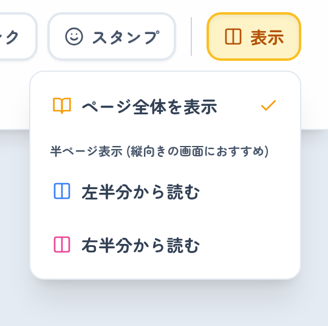

「ページ全体を表示」「左半分から読む」「右半分から読む」から選びます。

選びかたの手順:

1. ツールバーの「表示」を押してください。
2. 「左半分から読む」または「右半分から読む」を押してください。
3. 元に戻すときは、同じところから「ページ全体を表示」を押してください。

国語の教科書のように紙面を右から読むものは「右半分から読む」を選んでください。

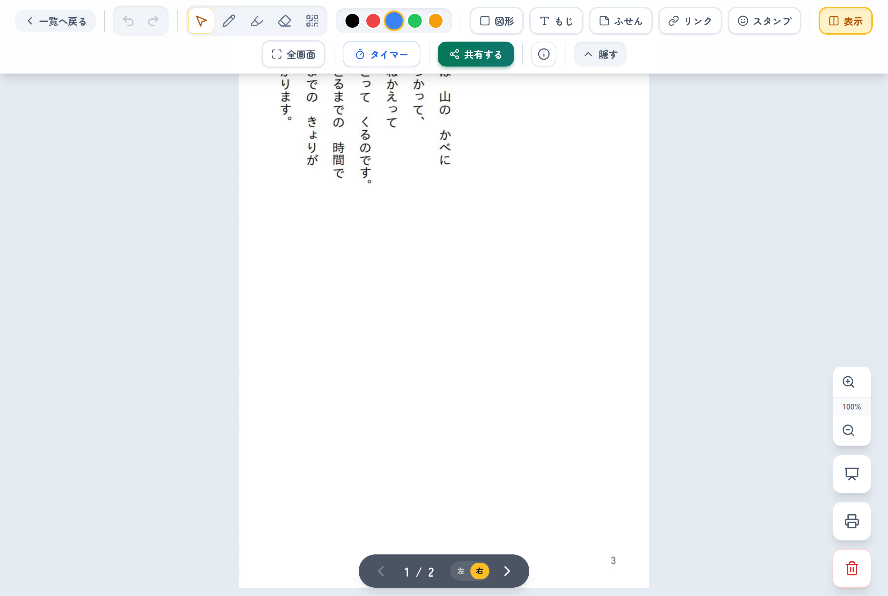

見開きのページの右半分だけが映っています。

半ページ表示のあいだは、画面下のバーに「左」「右」の切りかえが出ます。ここからでも、いま見ている側を変えられます。

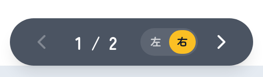

いま見ている側が、黄色く出ます。

【！】覚えておいていただきたいこと:

- ページを送ると「いま見ている半分 → もう半分 → 次のページの前半分」の順に進みます。
- 切り取って見せているだけなので、書きこみの位置はずれません。保存されている内容も変わりません。
- ただし印刷だけは、見えている半分だけが紙に出ます（「いま開いているページを紙に印刷する」の章）。
- 選んだ見せかたは覚えているので、次に開いたときも同じ見せかたになります。
- スタンプを押すと、いま見えている側の中央に置かれます。

### 電子黒板に大きく映す（提示モード）

画面の右下にある、モニターのマークを押してください。文字とボタンがひとまわり大きくなり、教室のうしろの席からも読める大きさになります。

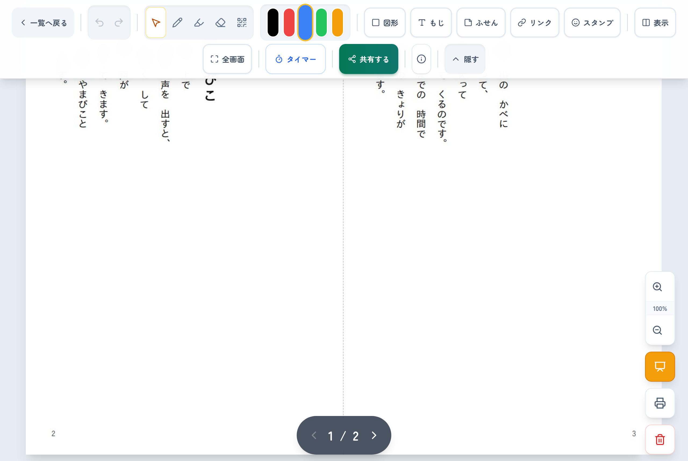

ボタンも文字も大きくなり、押したボタンが色つきになります。

もう一度同じボタンを押すと元に戻ります。

### ページだけを画面いっぱいに映す（全画面）

ツールバーの「全画面」を押すと、ヘッダーもツールバーも隠れて、ページだけが画面いっぱいになります。キーボードの F キーでも切り替わります。

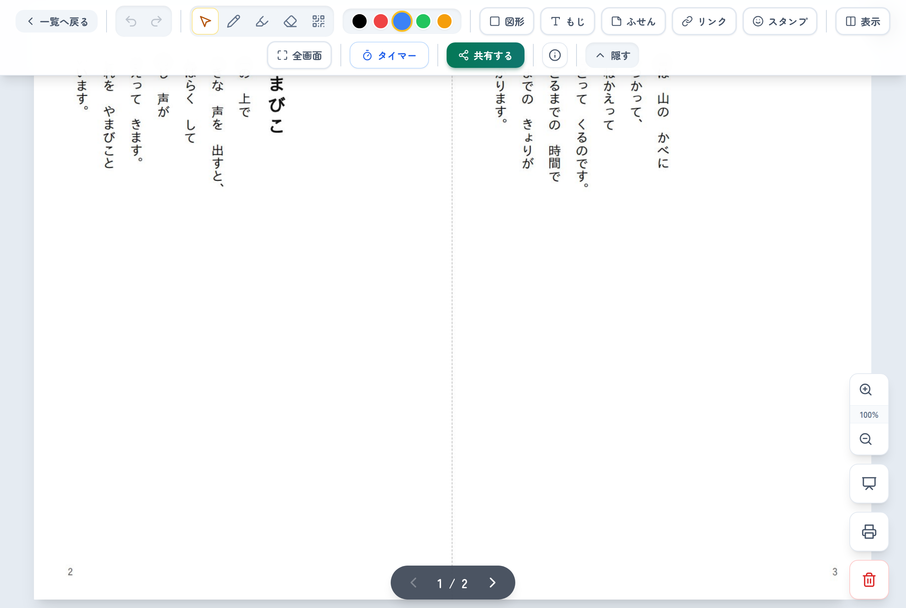

右上の小さなボタンで、全画面をやめられます。

【！】覚えておいていただきたいこと:

- 全画面のあいだも、ページ送りと拡大縮小のボタンは出たままです。
- 元に戻すには、右上のボタンを押すか、F キーか Esc キーを押してください。
- iPhone の Safari など、ブラウザの全画面に対応していない端末では、まわりのボタンを隠す「集中モード」として働きます。
- 提示モードと全画面は、いっしょに使えます。

## タイマーとストップウォッチで時間をはかる

活動の時間をはかる小さなパネルを、教材の画面に出したままにできます。ツールバーの「タイマー」を押すと、画面の左上に出ます。

### タイマーで残り時間をはかる

「あと何分」を見せたいときは、こちらを使います。パネルは 5 分から始まります。

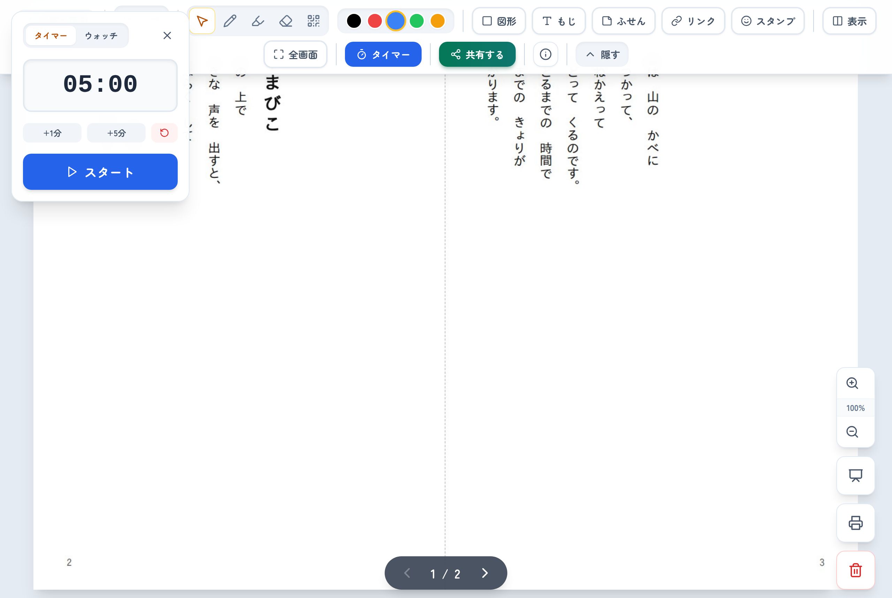

画面の左上に出ます。「タイマー」と「ウォッチ」を切り替えます。

使いかたの手順:

1. ツールバーの「タイマー」を押してください。パネルが出ます。
2. 5 分から始まります。「+1分」「+5分」を押して、はかりたい長さにしてください。
3. 「スタート」を押すと減っていきます。押すと「ストップ」に変わります。
4. 丸い矢印のボタンを押すと、5 分に戻ります。

### ストップウォッチで、かかった時間をはかる

パネルの左上にある「ウォッチ」を押すと、ストップウォッチに変わります。0 から数え上げます。「スタート」で始まり、「リセット」で 0 に戻ります。

【！】覚えておいていただきたいこと:

- パネルを出したまま、ページを送ったり書きこんだりできます。
- 0 になると、数字が赤くなって点滅します。音は鳴りません。教室で使うときは、画面が見えるところに置いてください。
- パネルの右上の × で閉じます。閉じると数え直しになります。
- 「タイマー」と「ウォッチ」は別々に数えています。切り替えても、それぞれの数はそのまま残ります。ただし、表示していないほうは進みません。

## プリントのQRコードを読み取る

紙のプリントに印刷された QR コードを、アプリの中から読み取って、その場で Web ページを開けます。児童生徒に URL を打たせずに済みます。

### QRコードを囲んで読み取る

読み取りの手順:

1. QR コードが写っているページを開いてください。
2. ツールバーの、QR コードのマークを押してください。キーボードの Q キーでも切り替わります。

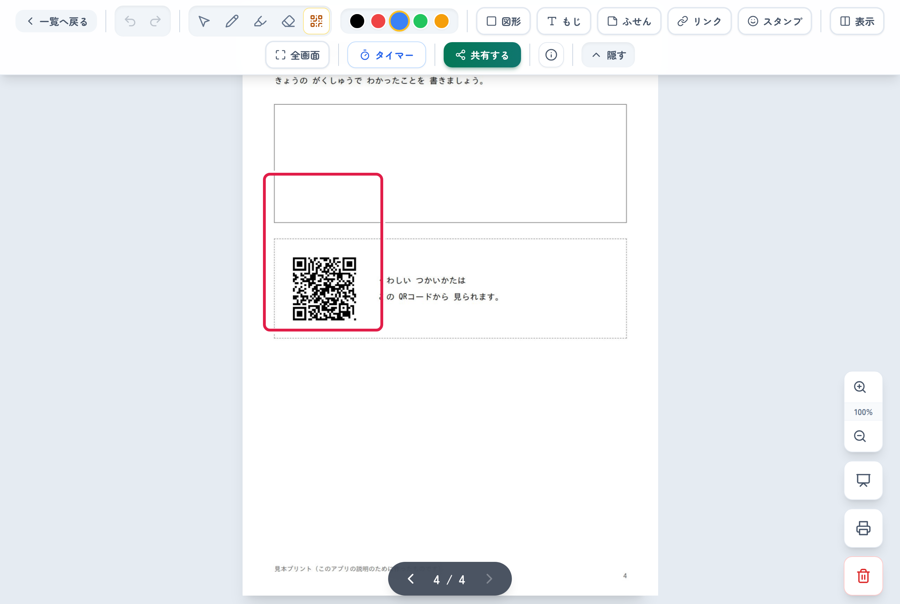

赤い枠のように、QR コードのまわりを少し広めに囲みます。

3. QR コードのまわりを、少し広めにドラッグで囲んでください。
4. 「QRコードを解析中...」と出たあと、読み取れると新しいタブでその Web ページが開きます。

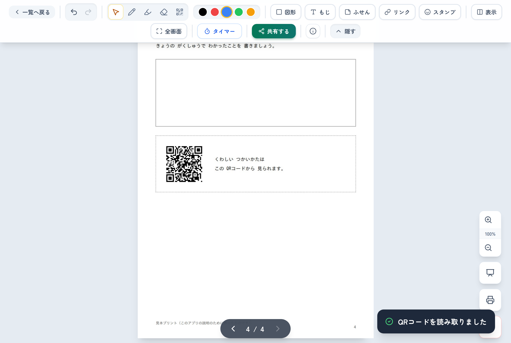

「QRコードを読み取りました」と画面の右下に出ます。

【！】覚えておいていただきたいこと:

- 囲まずにページを 1 回押すだけでも読み取れます。そのときはページ全体から QR コードを探します。
- 小さくかすれた QR コードでも読めるよう、拡大したり白黒を反転したりしながら探します。表示のために小さくする前の、元のページの絵から探すので、画面上で小さく見えていても読めることがあります。
- 見つからないときは「QRコードが見つかりません。QRコードの周囲を少し広めに囲んでみてください。」と出ます。白い余白ごと囲むと読めることが多いです。
- 安全のため、新しいタブで開くのは `https://` か `http://` で始まるアドレスだけです。それ以外のときは開かずに、読み取った内容を画面に出すだけにとどめます。
- 読み取りが終わると、道具は自動で「選択」に戻ります。続けて読み取るときは、もう一度 QR のマークを押してください。

## いま開いているページを紙に印刷する

画面の右下にある、プリンターのマークを押すと、いま開いているページを書きこみごと印刷できます。押すと、ブラウザの印刷の画面が開きます。

### 印刷する前に確かめること

印刷の手順:

1. 画面の右下にある、プリンターのマークを押してください。ブラウザの印刷の画面が開きます。
2. 紙の向き（たて・よこ）が合っているか見てください。横長のページは自動で「よこ向き」に切り替わります。
3. 「背景のグラフィック」にチェックが入っているか確かめてください。Chrome では「詳細設定」を開くと出てきます。
4. よければ「印刷」を押してください。

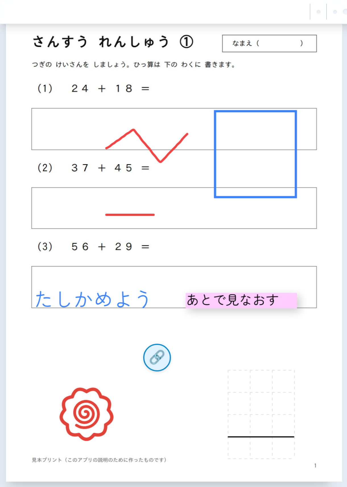

書きこみもふせんもスタンプも、そのまま紙に出ます。

【！】覚えておいていただきたいこと:

- 「背景のグラフィック」のチェックが外れていると、スタンプの色や枠、ふせんの色が真っ白になって印刷されます。ここがいちばん多いつまずきです。
- 一度に印刷できるのは、いま開いている 1 ページだけです。複数ページを刷るときは、ページを送りながらくり返してください。
- 半ページ表示のまま印刷すると、いま見えている半分だけが紙に出ます。ページ全体を刷りたいときは、先に「表示」から「ページ全体を表示」に戻してください。
- 画面のボタンやツールバーは紙には出ません。

## 児童生徒の端末へ教材を配る（共有・あいことば）

先生の端末から児童生徒の端末へ、PDF と書きこみをまるごと直接送れます。サーバーを経由しないので、データが外部に残りません。配れるのは、いま開いている 1 つの教材だけです。

### 先生の端末で共有を始める

共有の手順:

1. 配りたい教材を開いて、ツールバーの「共有する」を押してください。
2. QR コードとアドレス、そして 5 文字の「あいことば」が出ます。

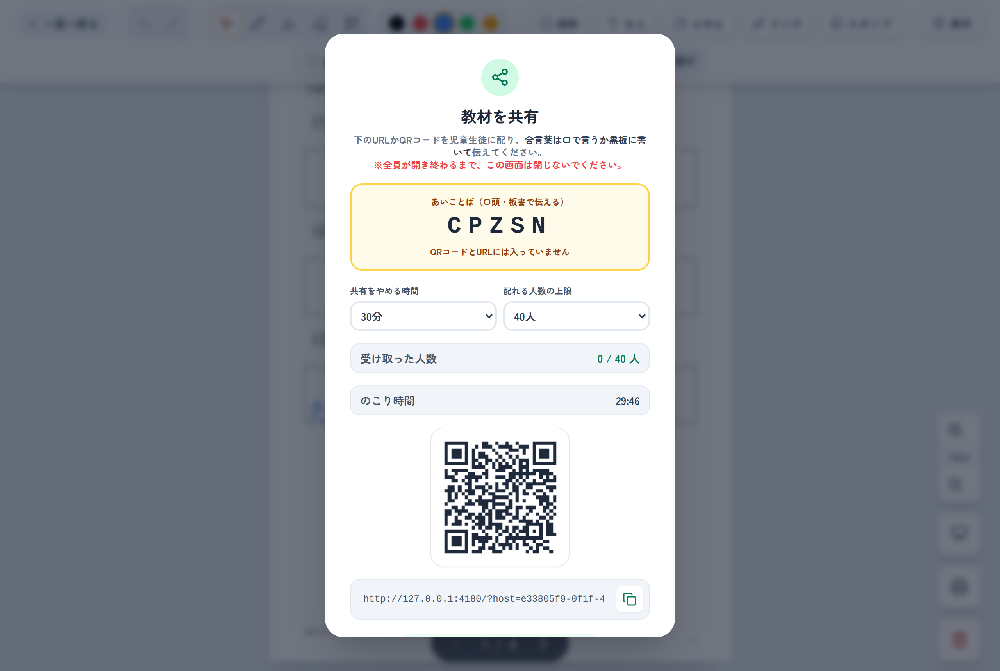

あいことばは、QR コードにもアドレスにも入っていません。

3. QR コードを児童生徒に見せてください。アドレスを配る場合は、右のボタンでコピーできます。
4. あいことばは、口で言うか黒板に書いて伝えてください。
5. 配り終わったら、この窓をいちばん下までスクロールして「共有を終了して閉じる」を押してください。

この画面では、共有をやめるまでの時間（10 分・30 分・60 分。はじめは 30 分）と、配れる人数の上限（5 人・10 人・40 人・80 人。はじめは 40 人）を選べます。どちらも共有の途中で変えられます。「受け取った人数」と「のこり時間」も、この画面に出ています。

### 児童生徒の端末で受け取る

受け取りの手順:

1. 児童生徒が QR コードを読み取る（またはアドレスを開く）と、あいことばを入れる画面が出ます。

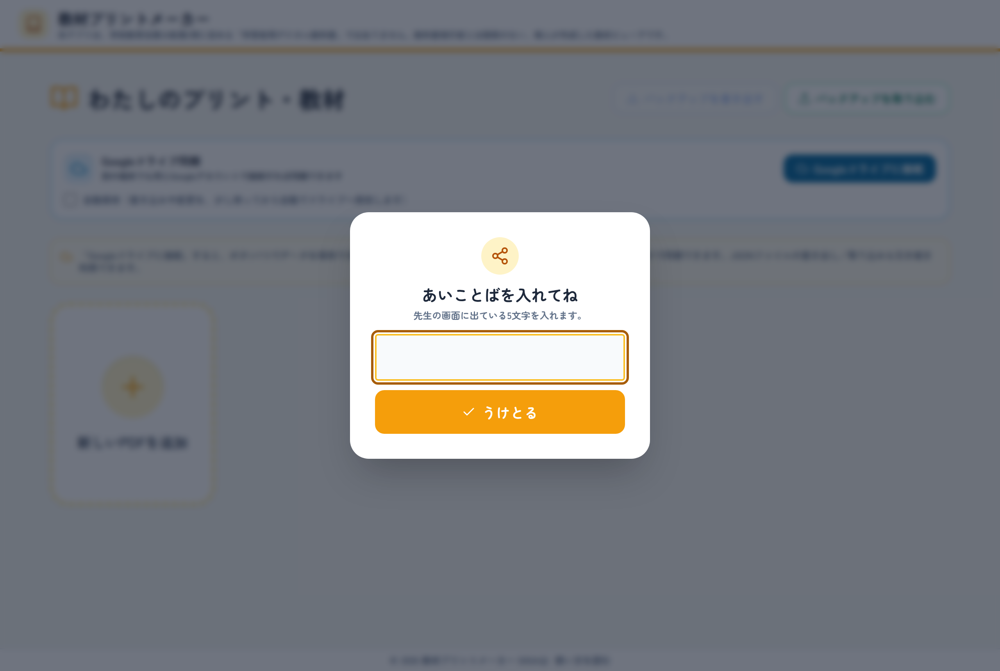

先生の画面に出ている 5 文字を入れてもらいます。

2. 先生が伝えたあいことばを入れて「うけとる」を押してもらってください。
3. 「データを受け取っています」と出て、終わると教材が開きます。

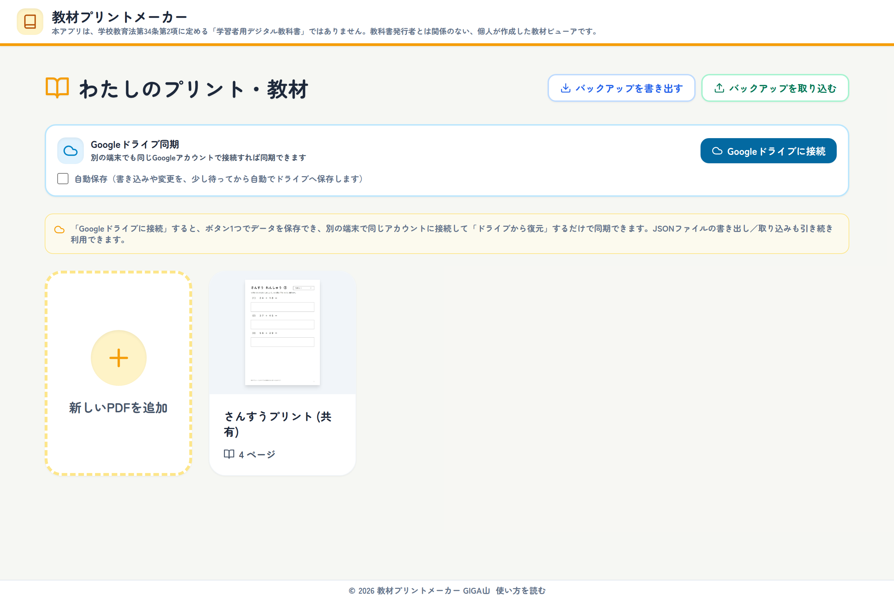

名前のうしろに「(共有)」が付いた別の教材として入ります。

【！！】最重要注意事項:

- 受け取った端末ではじめてこのアプリを開いたときは、そのあとに「使うときの注意」が出ます。児童生徒には「わかりました」を押してもらってください。
- あいことばを教室の外に出さないでください。QR コードとアドレスだけでは受け取れませんが、あいことばまで伝わると、校外からでも受け取れてしまいます。
- あいことばは共有のたびに作り直されます。見まちがえやすい 0 と O、1 と I と L は使いません。小文字で入れても、空白やハイフンが混じっても通ります。
- 1 つの接続であいことばを 3 回まちがえると、その接続は切られます。QR コードの読み取りからやり直してもらってください。
- 配布のあいだ、先生の画面は開いたままにしてください。「共有を終了して閉じる」を押すと、その時点で配布が止まります。
- のこり時間が 0 になると、自動で配布が終わります。押し忘れても止まります。
- 1 人に配ったあともそのまま待機しているので、続けて次の子に配れます。
- 配ったあとは同期しません。送られるのは「配った時点のコピー」です。先生があとから書き足しても、児童生徒の端末には届きません。
- 先生と児童生徒が同じネットワーク（校内 Wi-Fi など）につながっているのがいちばん確実です。一度に大人数へ配ると時間がかかるので、10 人ずつくらいに分けるとスムーズです。

## 書きこみを守る（バックアップの書き出しと取りこみ）

書きこみはその端末の中にしかありません。端末を初期化した、ブラウザの閲覧データを削除した、別の端末に乗りかえた、といったときには消えます。学期に一度はバックアップを取っておくことをおすすめします。

### バックアップを書き出す

最初の画面の右上に、青い「バックアップを書き出す」と緑の「バックアップを取り込む」が並んでいます。

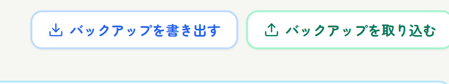

左が書き出し、右が取りこみです。

書き出しの手順:

1. 最初の画面「わたしのプリント・教材」を開いてください。
2. 「バックアップを書き出す」を押してください。
3. `digital-textbook-backup-（日時）.json` というファイルがダウンロードされます。
4. そのファイルを Google ドライブや USB など、端末の外に置いてください。

教材・書きこみ・マイスタンプが、すべてこの 1 ファイルに入ります。

### バックアップを取りこむ

取りこみの手順:

1. 「バックアップを取り込む」を押して、さきほどのファイルを選んでください。
2. 中身を確かめる画面が出ます。

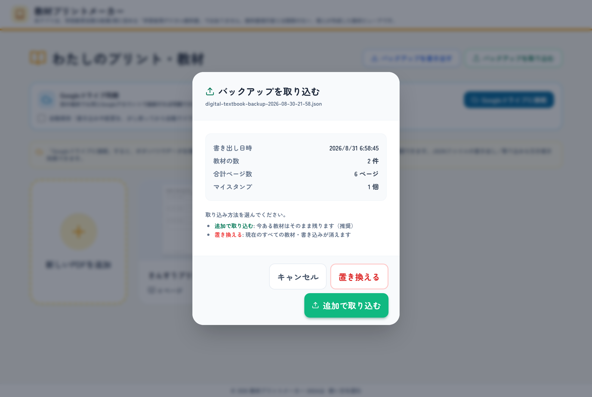

書き出した日時・教材の数・合計ページ数・マイスタンプの数が出ます。

3. 「追加で取り込む」か「置き換える」かを選んでください。
4. 「置き換える」を選ぶと、もう一度確認の窓が出ます。

【！！】最重要注意事項:

- 「追加で取り込む」は、いまある教材を残したまま足します。複数の端末の内容をまとめたいときはこちらです。
- 「置き換える」は、いまある教材・書きこみ・マイスタンプをすべて消してから入れかえます。元に戻すことはできません。
- 同じ教材が重なったときは、名前に「(取込)」が付いた別の 1 件として入ります。上書きはされません。
- 取りこむファイルがこのアプリのバックアップでないときは「このデータはバックアップ形式ではありません」と出て、何も起きません。

## Googleドライブとつないで、別の端末と同期する

先生ご自身の Google ドライブに、ボタン 1 つで保存・復元ができます。別の端末で同じ Google アカウントにつなげば、そのまま続きが使えます。この章は使わなくてもかまいません。前の章のバックアップだけでもデータは守れます。

### ドライブにつなぐ

最初の画面の上のほうに、水色の枠の「Googleドライブ同期」のパネルが出ています。

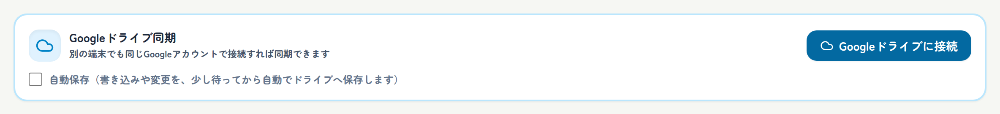

「Googleドライブに接続」を押すところから始めます。

つなぐ手順:

1. 「Googleドライブに接続」を押してください。
2. Google のログイン画面が出ます。学校のアカウントでログインしてください。
3. このアプリにファイルの作成を許可するかを聞かれます。内容を読んで、許可してください。
4. パネルに「接続中」と出れば、つながっています。

見慣れない許可の画面が出ますが、これはアプリが先生の代わりにドライブへファイルを 1 つ置くための許可を求めるものです。このアプリが触れるのは、このアプリが作ったファイルだけで、ドライブの中のほかのファイルは読めない設定になっています。

### 保存する・復元する・自動保存にする

つながると、ボタンが「ドライブに保存」「ドライブから復元」「切断」に変わります。

- 「ドライブに保存」を押すと、いまのデータがドライブに保存されます。
- 「ドライブから復元」を押すと、ドライブに保存したデータを取りこみます。
- パネルの下の「自動保存」にチェックを入れておくと、書きこみや変更のあと、少し待ってから自動でドライブへ保存します。
- 「切断」を押すと、接続を解除します。ドライブのファイルは消えません。

【！】覚えておいていただきたいこと:

- 保存先は、先生のドライブの中の `digital-textbook-backup.json` という 1 ファイルだけです。2 回目からは同じファイルに上書きされるので、ドライブがファイルだらけになることはありません。
- 最後に保存した日時が、パネルの中に出ます。
- 教材が 1 つも無いときは保存できません。「保存する教材がありません」と出ます。
- このパネルが出てこないときは、お使いのアドレスでは同期が設定されていません。バックアップの書き出しと取りこみは、そのまま使えます。

## キーボードとタブレットでの操作

キーボードのある端末では、よく使う操作をキーで呼べます。タブレットでは指でのなぞりが使えます。

### キーボードのショートカット

ツールバーのいちばん右のほうにある、丸に i のマークを押すと、一覧が出ます。キーボードの ? キーでも開きます。

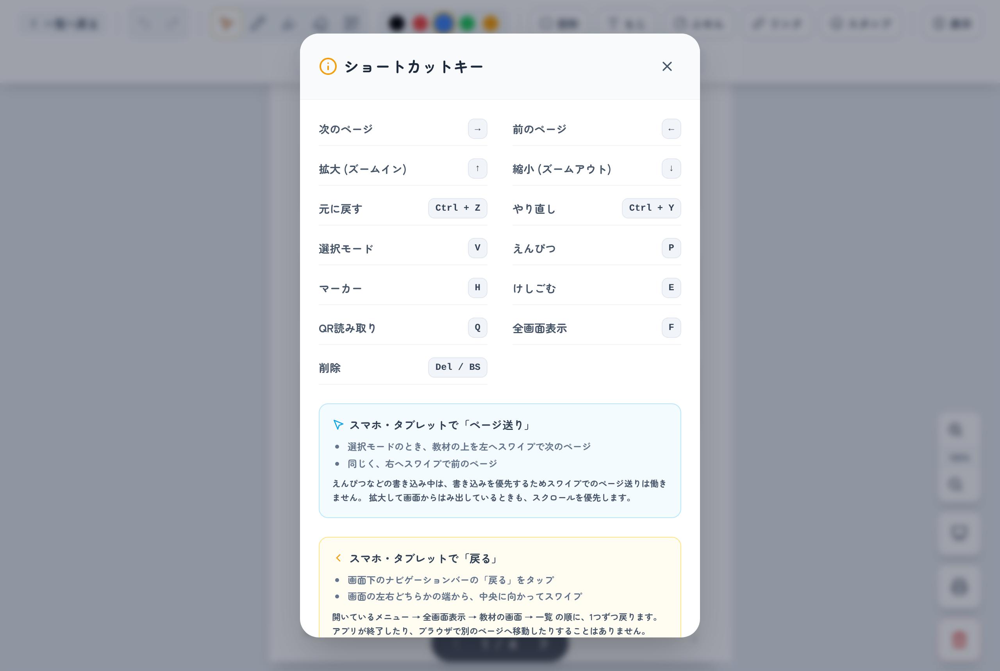

ページ送り・拡大縮小・道具の切り替えが並びます。

よく使うものを挙げます。右矢印キーと左矢印キーで次のページと前のページ、上矢印キーと下矢印キーで拡大と縮小、Ctrl + Z で元に戻す、Ctrl + Y でやり直し、V で選択、P でえんぴつ、H でマーカー、E でけしごむ、Q で QR 読み取り、F で全画面です。Mac では Ctrl の代わりに ⌘ でも動きます。

【！】覚えておいていただきたいこと:

- Esc 以外のキーは、教材を開いているときだけ効きます。
- 入力欄や、文字・ふせんを打っている最中は、どのキーも書きこみ側には効きません。
- Esc キーは「1 つ前の階層へ戻る」です。開いているメニューや窓を閉じるのに使えます。

### タブレット・スマートフォンでのなぞり操作

指でのなぞりは 2 種類あります。

- 選択の状態のときに、教材の上を左へなぞると次のページ、右へなぞると前のページに進みます。
- 画面の左右どちらかの端から中央に向かってなぞると、1 つ前の階層へ戻ります。画面下のナビゲーションバーの「戻る」をタップしても同じです。

戻る順番は、開いている窓 → メニューやパネル → ツールバー → 全画面表示 → 教材の画面 → 一覧です。一覧でさらに戻ろうとしても「ここが最初の画面です」と出るだけで、アプリが終了したり、ブラウザで別のページへ移動したりすることはありません。

【！】覚えておいていただきたいこと:

- ページ送りのなぞりは、選択の状態のときだけ働きます。えんぴつなどで書きこんでいる最中は、書きこみが優先されます。
- 拡大してページが画面からはみ出しているときも、スクロールが優先されます。
- 「戻る」として扱うのは、画面の端から始まる指でのなぞりだけです。Apple Pencil などのペン入力とマウス操作は、そのまま書きこみに使えます。

## うまくいかないとき

よくあるつまずきと、その場で試せることを並べます。ここで解決しないときは、この章の最後をお読みください。

### 画面が真っ白のまま、または「ライブラリの読み込みに失敗しました」と出る

アプリが使う道具を読みこめていません。学校のネットワークが混んでいるときに起きます。

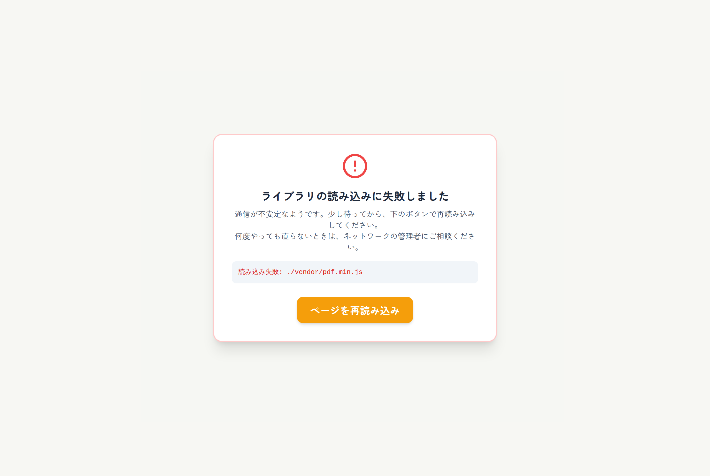

「ページを再読み込み」を押すと、もう一度読みこみます。

- インターネットにつながっているか確かめてください。はじめて開くときはつながっている必要があります。
- しばらく待ってから「ページを再読み込み」を押してください。
- それでも直らないときは、学校のネットワーク担当の先生にご相談ください。

### 書きこんだものが消えた

- 別のブラウザで開いていませんか。Chrome で書いたものは Safari では見えません。
- ブラウザの「閲覧データを削除」をしませんでしたか。これをすると消えます。
- iPad で、ホーム画面に追加せずに 7 日以上使っていませんでしたか（「アプリとして端末に入れる」の章）。
- バックアップがあれば、そこから戻せます。

### PDF が読みこめない

- パスワードのかかった PDF は読みこめません。
- ファイルが壊れていないか、ほかのアプリで開いて確かめてください。
- ページ数が非常に多い PDF は、端末のメモリが足りず途中で止まることがあります。分けてから読みこんでください。

### 道具のバーが見あたらない

画面の左上にある「ツール」を押してください。ページを広く使うため、ふだんは隠れています。全画面表示のあいだは、右上のボタンで全画面をやめると出てきます。

### 動きが重い、カクカクする

- 開いているタブを減らしてください。Chromebook はメモリが少なく、タブをたくさん開くと動きが悪くなります。
- 倍率を 100% に戻してみてください。
- 使わない教材を一覧から消すと軽くなります。

### 印刷したら色や枠が出ない

印刷の画面の「詳細設定」で、「背景のグラフィック」にチェックを入れてください（「いま開いているページを紙に印刷する」の章）。

### 共有（配布）ができない

- 先生の画面を閉じていませんか。共有の画面は開いたままにしてください。
- 先生と児童生徒が同じネットワークにつながっているか確かめてください。
- 学校のネットワークによっては、端末どうしの直接通信が禁止されていることがあります。その場合は、バックアップファイルを配る方法をお使いください。

### QRコードが読み取れない

- 囲む範囲を少し広めにしてください。QR コードのまわりの白い余白ごと囲むのがコツです。
- 印刷がかすれていたり、大きく傾いていたりすると読めないことがあります。

### Googleドライブにつなぐとエラーが出る

画面に「エラー 400: origin_mismatch」と出たときは、いま開いているアドレスが Google 側に登録されていないという意味です。先生の端末やアカウントの問題ではないので、この画面では直せません。

- いま開いているアドレスが `https://digital-textbook.giga-school.com/` になっているか確かめてください。古いブックマークやホーム画面のアイコンからだと、こちらの画面が出ることがあります。
- 正しいアドレスでも出るときは、公開している担当者にお伝えください。
- 直るまでのあいだも、バックアップの書き出しと取りこみはふだんどおり使えます。書きこんだものが消えることはありません。

### 「あたらしい バージョンが あります」と出た

アプリが新しくなったお知らせです。「さいしんに する」を押してください。書きこみは消えません。急いでいるときは「あとで」を押しても構いません。押すまで切り替わらないので、授業の途中で勝手に画面が変わることはありません。

### それでも解決しないとき

まず、このアプリを教えてくださった先生や、校内の情報担当の先生にご相談ください。同じ端末・同じネットワークで使っている方なら、すぐに分かることが多いです。

そのうえで解決しないときは、このページのいちばん下にある問い合わせ先からお知らせください。
