# 教室で使えるかもしれないもの作り #◯ 「このプリント、そのまま大きく映したい」PDFに直接書きこめるアプリ「デジタル教科書メーカー」

## 🏫 はじめに

印刷室でプリントを刷りながら、こんなふうに思ったことはありませんか。

「答え合わせのとき、このプリントをそのまま前に映せたらいいのに」

書画カメラを教室まで運んできて、ピントを合わせて、紙が光らないように角度を変えて。ようやく映ったと思ったら、赤ペンで書きこむたびに手が影になって、うしろの席から見えなくなる。子どもから「見えません」と言われて、また角度を直す。そのあいだ、教室の時間はどんどん流れていきます。

そして授業が終わると、こんどは40枚の丸つけが待っています。はなまるを描いて、まちがいに印をつけて、ひとこと書いて、次の一枚へ。放課後の職員室で赤ペンを握りながら、明日の準備がまだ何も終わっていないことに気づく。この繰りかえしに、心当たりのある先生は多いのではないでしょうか。

「デジタル教科書メーカー」は、手もとにある PDF をブラウザに読みこませるだけで、その上に直接書きこめるようにするアプリです。読みこんだプリントは、大型テレビにそのまま大きく映せます。丸つけ用のスタンプも、算数の位取り表も、国語の「はじめ・中・おわり」も、押すだけで置けます。書きこんだものは、子どもの端末へそのまま配ることもできます。

ここから使えます。

https://gigayama.github.io/Digital_textbook/

会員登録もインストールもいりません。ブラウザで開けば、その場から使えます。無料です。広告も出ません。

なぜこれを作ったのか。いちばんの理由は、学校にすでにあるものを、そのまま生かしたかったからです。デジタル教材を新しく買うのではなく、先生方がこれまで作りためてきたプリントを、そのままデジタルで使えるようにする。その入口として、いちばん身近な PDF を選びました。

## 📱 このアプリでできること

開くと、こんな画面が出ます。「わたしのプリント・教科書」という棚です。ここに、読みこんだ PDF が並んでいきます。

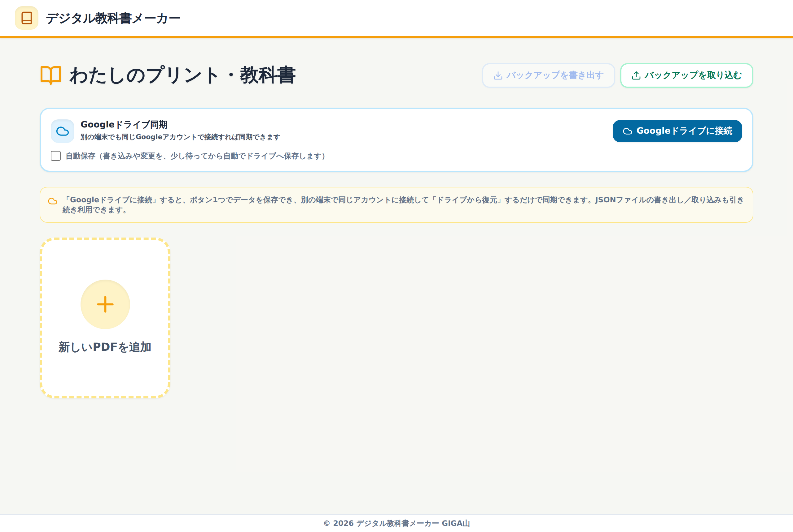

最初の画面。まだ何も入っていない状態です。

「新しいPDFを追加」を押して、ふだん印刷しているプリントの PDF を選ぶだけで、棚に一冊ぶんが加わります。表紙のかわりに一ページめの画像が出るので、あとから探すときも迷いません。何ページあるかも、カードの下に出ています。

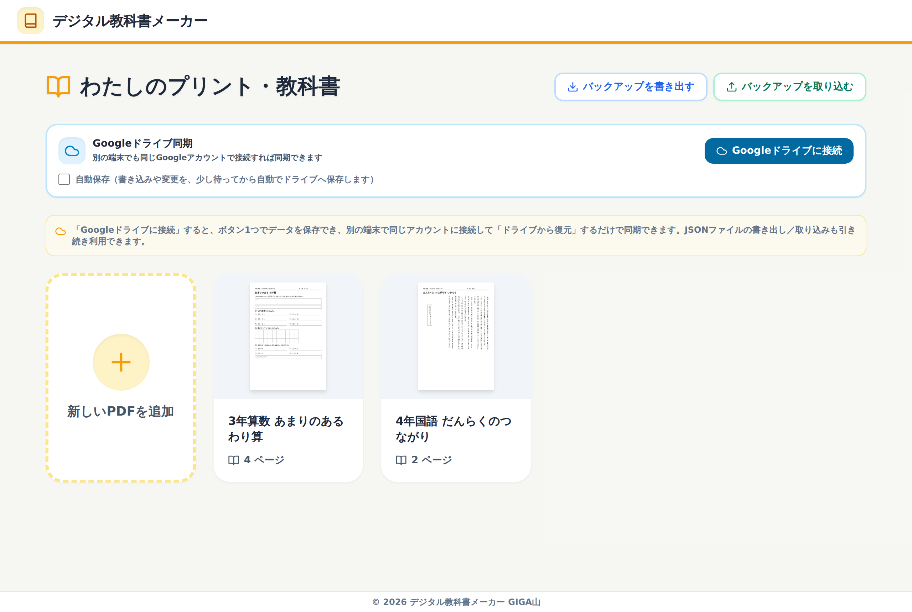

算数のプリントと国語のプリントを読みこんだところ。表紙とページ数が並びます。

読みこみにかかる時間は、ページ数によります。数ページのプリントなら待つほどでもありませんが、何十ページもある教科書だと、そのぶん時間がかかります。読みこんでいるあいだは画面を閉じないでください。一度読みこんでしまえば、次からはすぐ開けます。

カードを押すと、そのプリントが開きます。

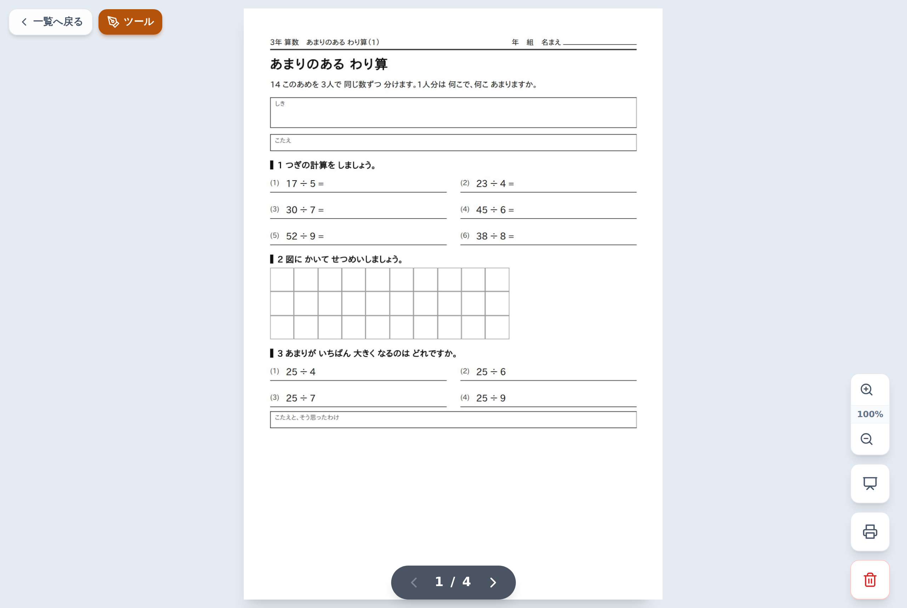

開いた直後の画面。道具は隠れていて、ページだけが大きく出ます。

道具を出したいときは、左上の「ツール」を押します。えんぴつ、マーカー、消しゴム、図形、文字、ふせん、スタンプが、画面の上にならびます。

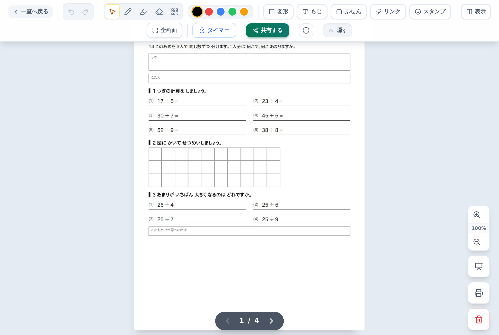

ツールバー。左から順に、元にもどす、道具の切りかえ、色、そして置くものが並びます。

えんぴつを選んで、色を赤にして、答えのところに丸をつけてみます。指でもマウスでも、タッチペンでも書けます。

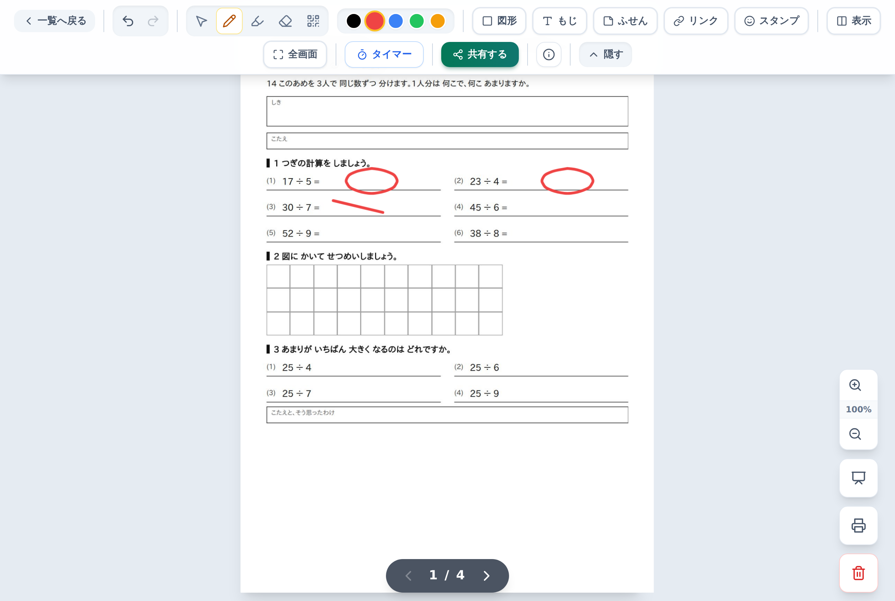

赤いえんぴつで丸つけをしたところ。まちがえた問題には、斜めの線を引いています。

マーカーは半透明なので、下の文字が透けて読めます。大事なところに線を引いても、問題文が隠れません。

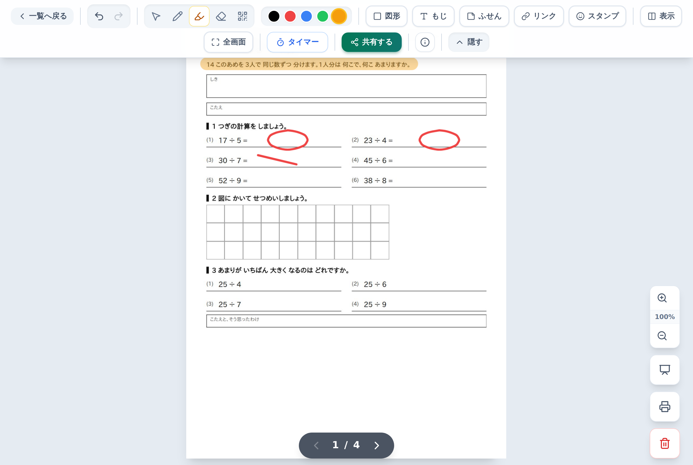

もんだい文にマーカーを引いたところ。下の文字はそのまま読めます。

ふせんも貼れます。「ここに気をつけて」と書いたふせんを、余白に貼っておく。紙のふせんとちがって、はがれて落ちることはありません。

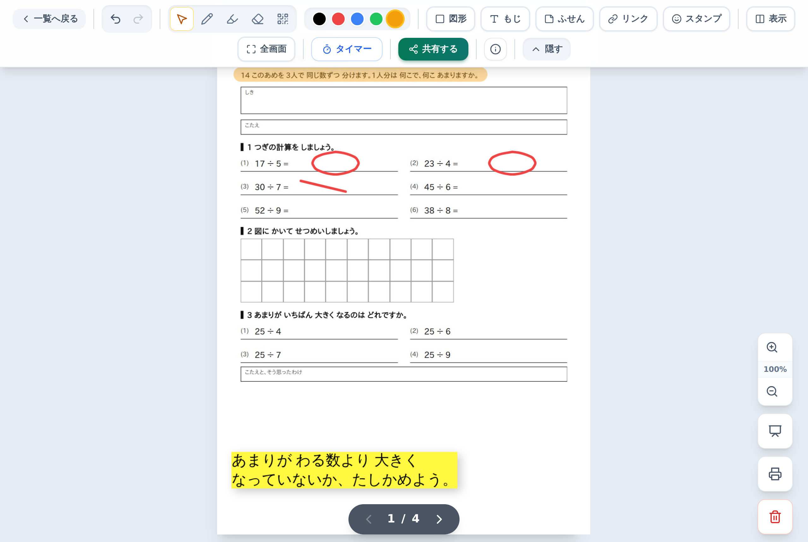

黄色いふせんに注意点を書いて、余白に貼りました。ふせんの色は4色から選べます。

書いたものは自動で保存されます。「保存」ボタンを押す必要はありません。うっかり画面を閉じてしまっても、次に開いたときには続きから始められます。

そして、いちばん使ってほしいのが「提示モード」です。画面の右下にあるモニターのマークを押すと、文字とボタンがひとまわり大きくなります。

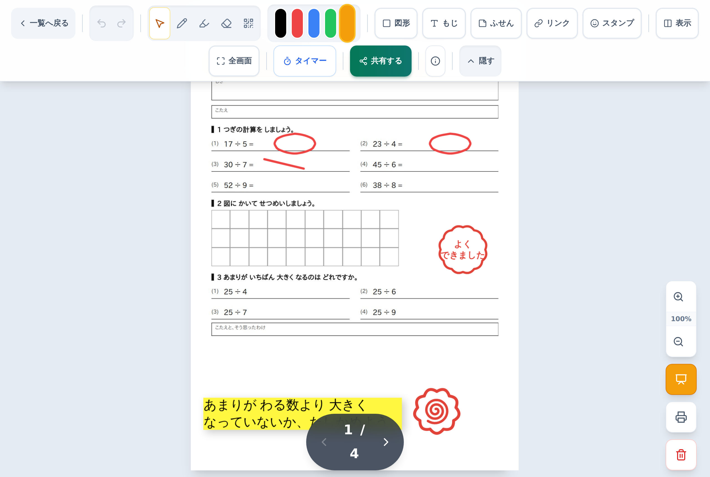

提示モード。教室のうしろの席からでもボタンが見える大きさになります。

大型テレビにつないだまま、ここを押すだけです。書画カメラのように紙の影が写りこむこともありませんし、書きこむ手が邪魔になることもありません。さらに大きく映したいときは「全画面」を押すと、道具も見出しも消えて、ページだけが画面いっぱいになります。

縦向きのタブレットで使うときのために、「半ページ表示」も入れました。A4 の横長のプリントは、縦の画面では小さくなりがちです。左半分だけ、右半分だけ、と切りかえて大きく見られるようにしてあります。

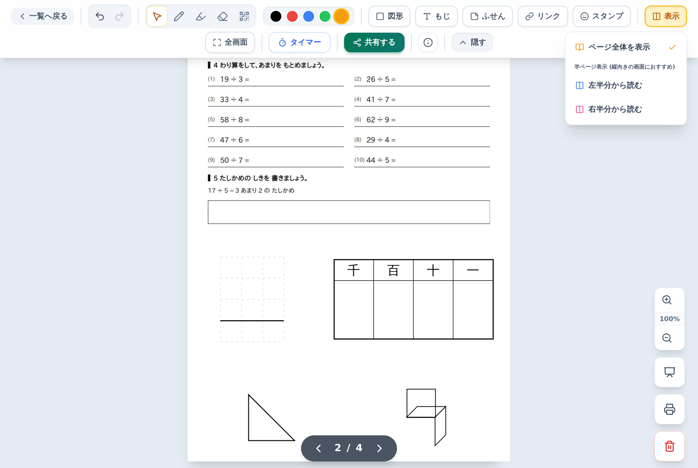

「表示」を押すと、ページ全体か、左半分か、右半分かを選べます。

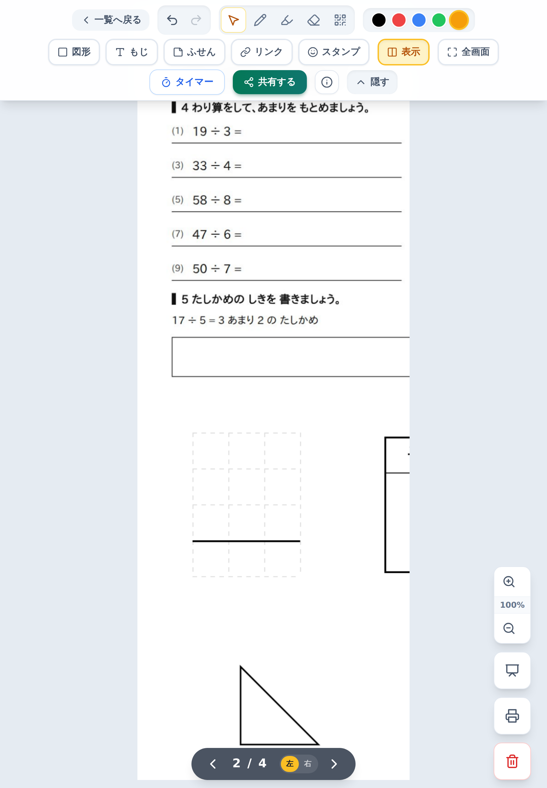

タブレットを縦にしたまま、左半分だけを大きく表示したところ。下のバーで左右を切りかえられます。

時間を計るためのタイマーも入っています。「あと5分でやめましょう」と口で言うより、画面に数字が出ているほうが、子どもたちには伝わりやすいのではないかと思います。

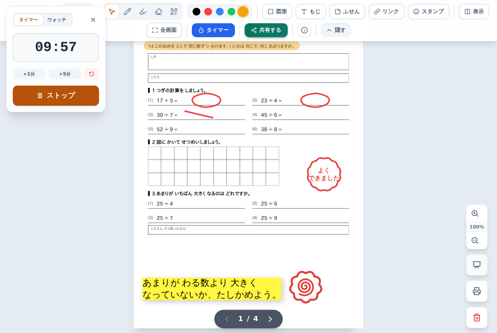

タイマーとストップウォッチ。画面のすみに出したまま、書きこみを続けられます。

キーボードのショートカットも用意しました。矢印キーでページをめくり、Ctrl と Z でもとにもどす。慣れてくると、画面を見ずに操作できるようになります。一覧はクエスチョンマークのキーで出ます。

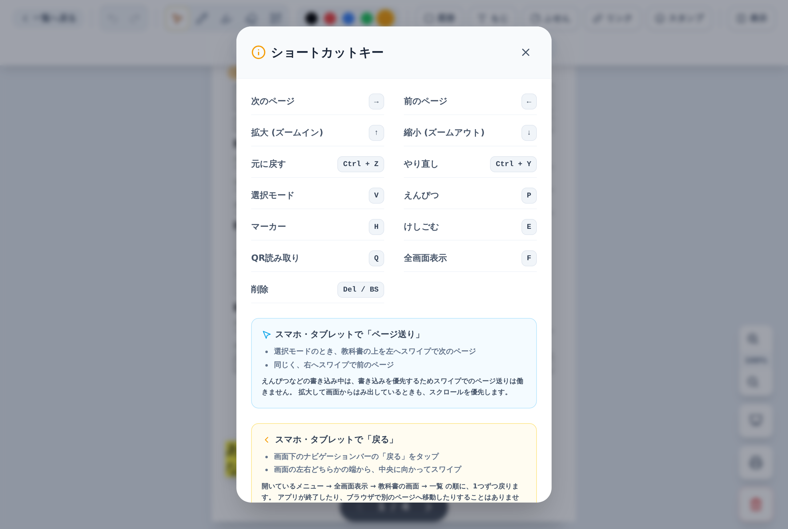

ショートカットの一覧。指やペンでの操作についても、ここに書いてあります。

## ✍️ 丸つけの道具が、はじめから全部入っています

このアプリでいちばん時間をかけたのが、スタンプです。教科ごとに分けて、全部で167種類を用意しました。数えたものなので、この数はそのままです。

まずは丸つけのスタンプ。はなまる、たいへんよくできました、よくできました、がんばりました、みました、合格、100点、二重丸。判子屋さんに並んでいそうなものは、だいたい入れました。

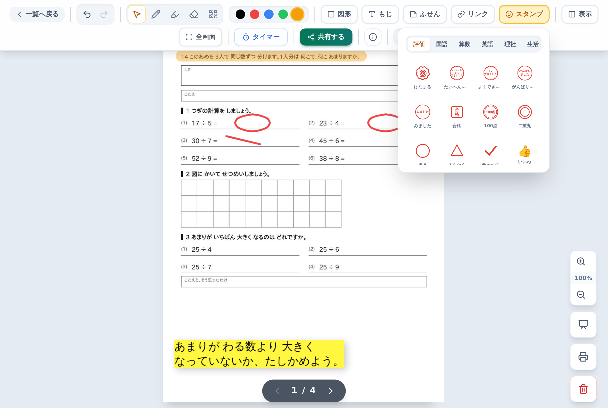

評価のスタンプは16種類。押すと、赤い判子の絵がそのまま置かれます。

これで丸つけをすると、こうなります。

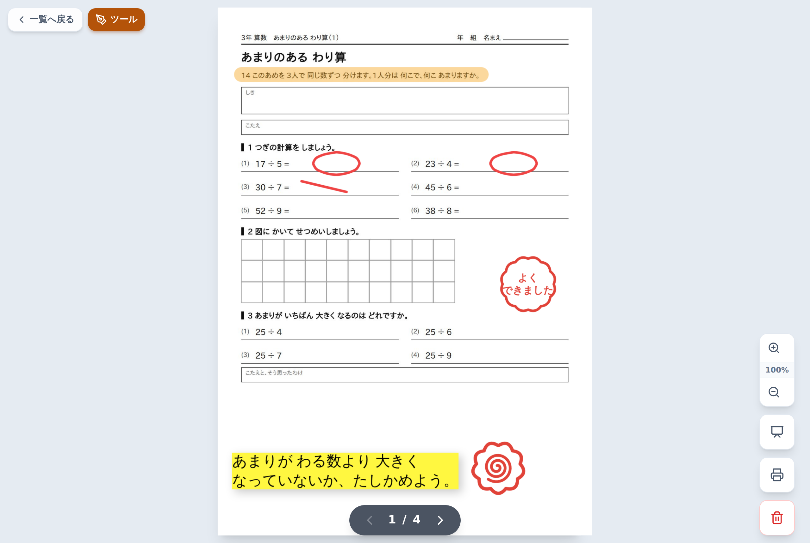

丸をつけて、線を引いて、ふせんを貼って、はなまるを押したところ。ここまで全部、画面のなかで終わります。

赤ペンで一枚ずつ描いていたはなまるが、押すだけになります。しかも、押したあとで場所も大きさも変えられます。紙だと描き直せませんが、これなら何度でもやり直せます。

教科の道具も入れました。算数には、1と10と100と1000のブロック、位取り表、筆算のわく、三角定規、立方体や直方体などの立体の図が入っています。

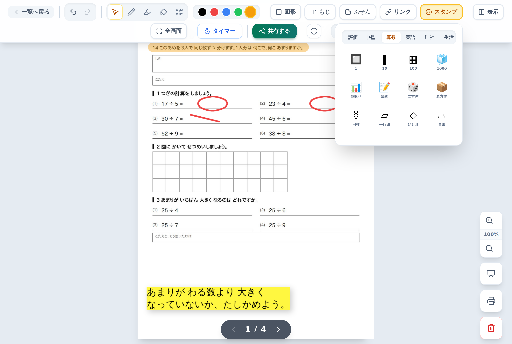

算数のスタンプは42種類。ブロックや位取り表、筆算のわくが並びます。

黒板に位取り表を書くのは、地味に時間がかかります。定規を当てて線を引いて、千、百、十、一と書きこんで。これがボタン一つで出てくるだけでも、授業の流れが止まらずにすみます。

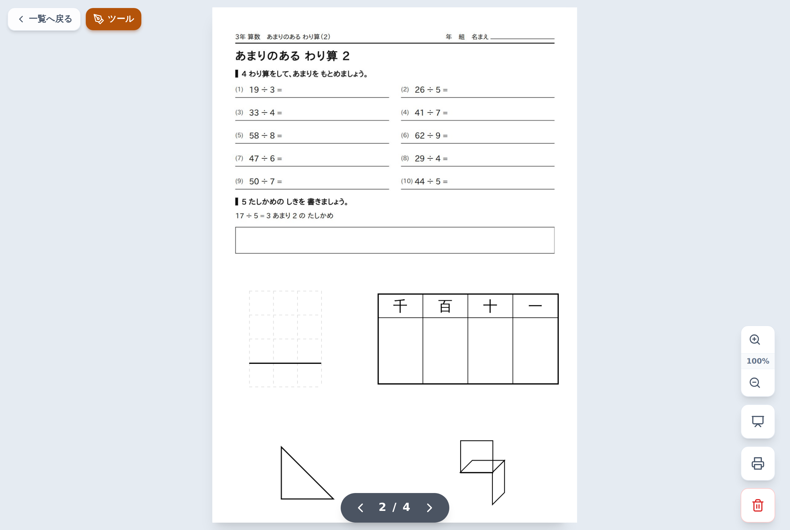

筆算のわく、位取り表、三角定規、立方体を並べたところ。大きさは自由に変えられます。

国語には、縦書きのスタンプを入れました。「いつ」「どこで」「だれが」「なにを」、そして「はじめ」「中」「おわり」。説明文の構造をつかむとき、段落のわきにこれを置いていくだけで、文章の組み立てが目に見えるようになります。

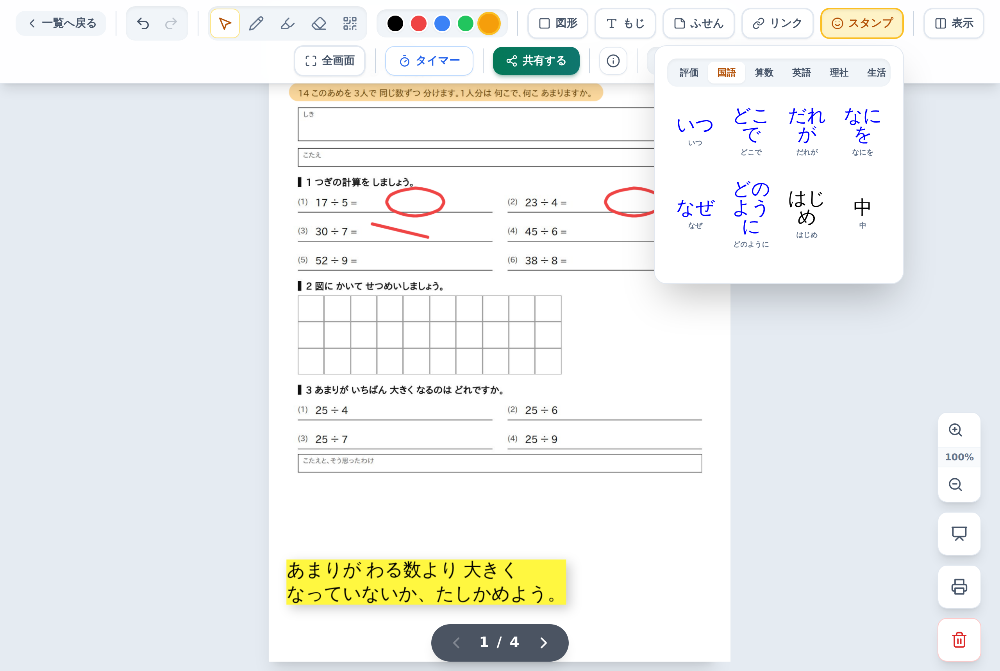

国語のスタンプは41種類。縦書きの言葉と、丸で囲んだ番号が入っています。

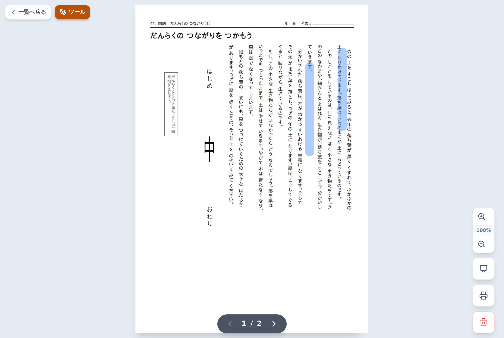

説明文の段落を「はじめ」「中」「おわり」に分けて、大事なところにマーカーを引いたところ。

ほかに、英語のスタンプが10種類、理科と社会のスタンプが34種類、生活と学級づくりのスタンプが24種類あります。理科と社会には、天気の記号や、地図記号、実験器具が入っています。生活には、発表、話し合い、ペア、グループといった、授業の形を示すものを入れました。

それでも、先生ごとに使いたい言葉はちがうはずです。だから「マイスタンプ」を作れるようにしました。好きな文字と色と枠の形を選んで登録すると、自分だけのスタンプができます。

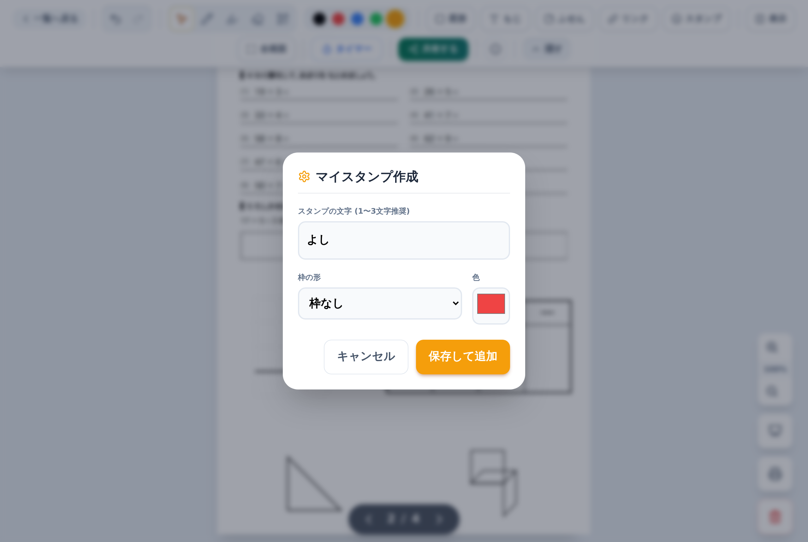

文字と枠の形と色を選ぶだけ。作ったスタンプは、次からスタンプの棚に並びます。

「よし」「もう一歩」「先生と話そう」。ふだん赤ペンで書いている言葉を、そのまま登録しておけます。

## 📤 子どもの端末へ、サーバーを通さずに配れます

書きこんだプリントを、子どもたちの端末へそのまま配れます。「共有する」を押すと、QRコードとアドレスが出ます。

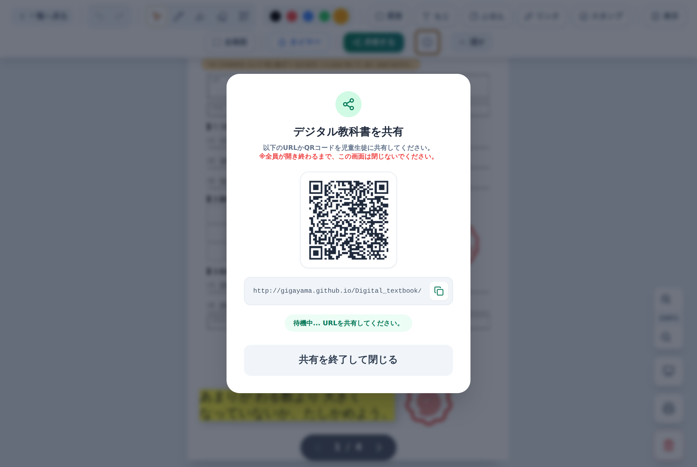

「共有する」を押すと出る画面。QRコードを大型テレビに映せば、子どもたちはそれを読み取るだけです。

子どもがこれを読み取ると、プリントと書きこみがまるごと、その子の端末に入ります。

子どもの端末で開いたところ。先生が書いた丸も、ふせんも、スタンプも、そのまま届きます。

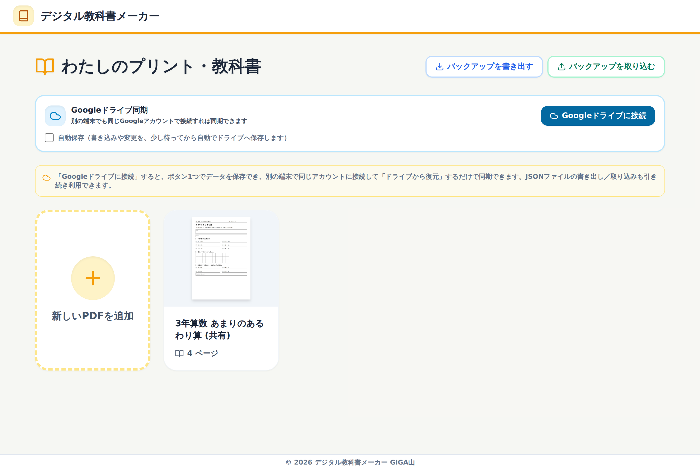

子どもの棚。受け取ったものには「(共有)」と付くので、自分のものと見分けられます。

ここがこのアプリのいちばん変わっているところなのですが、このやりとりは、どこかの会社のサーバーを通っていません。先生の端末から子どもの端末へ、直接送られます。データがよそに保存されることがないので、書きこんだ内容が外に残る心配がありません。

もちろん、いいことばかりではありません。先生の画面を開いたままにしておかないと、配布は途中で止まります。それから、一度に大人数へ配ると時間がかかるので、10人ずつくらいに分けたほうがうまくいきます。学校のネットワークによっては、端末どうしの直接のやりとりが禁止されていることもあります。その場合はこの機能は使えないので、あとで説明するバックアップのファイルを配ってください。

なぜサーバーを使わない作りにしたのか。理由は二つあります。一つは、子どもの書きこみをどこかに預けたくなかったからです。もう一つは、サーバー代がかかると、いつか止めなければならなくなるからです。無料で、これからも動きつづけるものにするには、この形しかありませんでした。

## ✨ 導入のメリット

三つのいいことが期待できます。

一つ目は、印刷の前に迷わなくなることです。これまでは「映すかもしれないから、この一枚は拡大コピーもとっておこう」と考える必要がありました。読みこんでしまえば、どのプリントもその場で大きくできます。拡大コピーの手間と紙が、そのぶん減ります。

二つ目は、丸つけの時間が短くなることです。はなまるを一つ描くのに数秒かかるとして、40人分だと、それだけで何分にもなります。押すだけになれば、その時間はまるごと浮きます。浮いた時間で、赤ペンでひとこと書く余裕が生まれるかもしれません。効率がよくなること自体が目的ではなくて、子どもに返す言葉を書く時間を取りもどしたい、というのが本当のねらいです。

三つ目は、休んだ子への手当てがしやすくなることです。授業で書きこんだプリントを、そのまま端末に送れます。「今日やったところ、ここに入れておくね」と渡せる。紙をコピーして机に置いておくよりも、書きこみごと届くぶん、何をやったかが伝わりやすいのではないかと思います。

## 🛠️ 【管理者向け】導入手順

情報担当の先生に相談するときに聞かれそうなことを、先に書いておきます。

まず、このアプリはインストールがいりません。ブラウザで次のアドレスを開くだけです。

https://gigayama.github.io/Digital_textbook/

そのうえで、次の三つを確認してください。

1. 校内のフィルタリングで、次のアドレスへの通信を許可してください。gigayama.github.io がアプリ本体です。fonts.googleapis.com と fonts.gstatic.com は、子ども向けの読みやすい書体を取ってくるために使います。0.peerjs.com は、端末どうしをつなぐときの待ち合わせに使います。書きこんだデータそのものはここを通りません。Googleドライブとつなぐ場合は accounts.google.com と www.googleapis.com も必要です。
2. 共有機能を使うなら、端末どうしの直接の通信が許可されているか確認してください。ここが塞がれていると、共有だけが使えません。ほかの機能はそのまま使えます。
3. 共用の端末で使う場合は、書きこみがその端末のなかに残ることを共有しておいてください。ブラウザの閲覧データを削除すると消えます。

個人情報の扱いについて、はっきり書いておきます。読みこんだ PDF も、書きこんだ内容も、その端末のなかにだけ残ります。どこかのサーバーへ送られることはありません。アプリを作った私も、中身を見ることはできません。共有機能を使ったときも、データは端末から端末へ直接届きます。

Googleドライブとつなぐ機能もありますが、これは先生ご自身のドライブに保存するためのものです。アプリが触れるのは、このアプリが作ったファイルだけという設定になっていて、ドライブのほかのファイルは読めません。使うかどうかは先生が選べます。

端末ごとに気をつけることが一つあります。iPad と iPhone を使う場合は、必ずホーム画面に追加してから使ってください。Safari には、しばらく使わなかったサイトのデータを7日で消すしくみがあります。ホーム画面に追加しておくと、この対象から外れます。追加せずに使っていると、長い休みのあとに書きこみが消えていることがあります。

保存できる量にも上限があります。ブラウザが割りあてる範囲までなので、端末の空き容量が少ないと保存に失敗することがあります。ページ数の多い PDF ほど場所を取ります。メモリの少ない Chromebook では、300ページを超えるような教科書を読みこもうとすると、途中で止まることがあります。そのときは PDF を分けてから読みこんでください。

学期に一度は、バックアップを取っておくことをおすすめします。「バックアップを書き出す」を押すと、ファイルが一つ書き出されます。それを Googleドライブなどに置いておけば、端末を替えても戻せます。

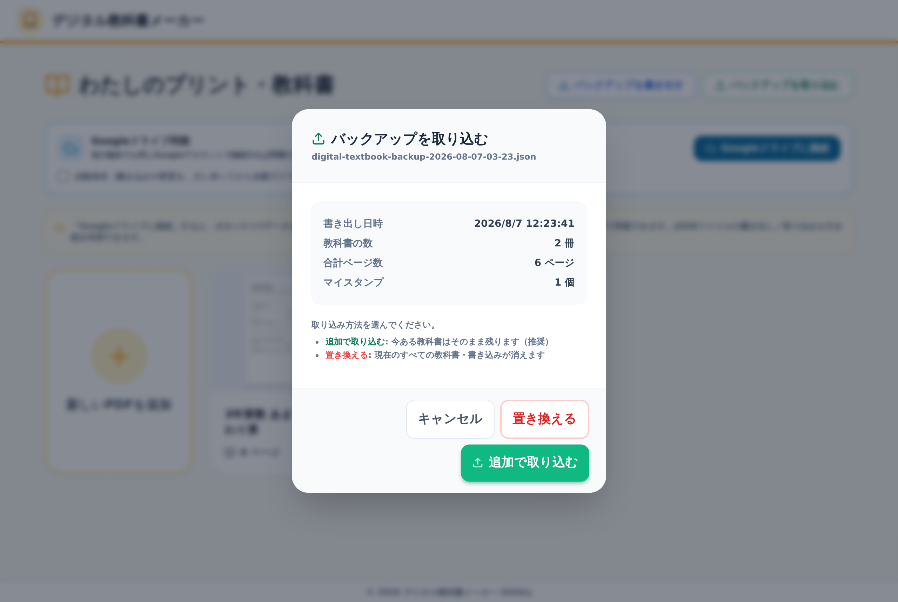

取り込むときは、何冊ぶんが入っているかを確かめてから決められます。いまあるものを残して足すか、まるごと置きかえるかも選べます。

## 📖 【利用者向け】使い方のガイド

はじめて使う先生のために、順番に書きます。

1. ブラウザで https://gigayama.github.io/Digital_textbook/ を開きます。「わたしのプリント・教科書」と出れば準備完了です。
2. 右上に「アプリを入れる」というボタンが出ていたら、押してインストールしておきます。次からはアイコンから開けます。iPad の場合は Safari で開いて、共有ボタンから「ホーム画面に追加」を選びます。
3. 「新しいPDFを追加」を押して、使いたいプリントの PDF を選びます。「PDFを読み込みました」と出れば完了です。
4. 棚に並んだカードを押すと、そのプリントが開きます。
5. 左上の「ツール」を押して、道具を出します。
6. えんぴつを選んで、色を選んで、書いてみます。まちがえたら Ctrl と Z でもどせます。
7. 丸つけをするときは「スタンプ」を押して、上のタブから「評価」を選び、使いたい判子を押します。置いたあとは、指やマウスでつまんで動かせます。角をつまむと大きさも変えられます。
8. 大型テレビに映すときは、画面の右下にあるモニターのマークを押します。もう一度押すともとにもどります。
9. 紙に印刷したいときは、その下のプリンターのマークを押します。印刷の設定で「背景のグラフィック」にチェックが入っているか、必ず確かめてください。ここが外れていると、スタンプの色や枠が真っ白で印刷されます。
10. 子どもの端末に配るときは「共有する」を押して、出てきたQRコードを大型テレビに映します。全員が受け取り終わるまで、この画面は閉じないでください。
11. 使い終わったら、そのまま閉じて大丈夫です。書きこみは自動で保存されています。

うまくいかないときは、次のあたりを確かめてみてください。画面が白いままのときは、インターネットにつながっているか確認して、しばらく待ってから読みこみ直します。書きこみが消えたときは、別のブラウザで開いていないか確かめてください。Chrome で書いたものは Safari では見えません。共有ができないときは、先生の画面が開いたままになっているか、先生と子どもが同じネットワークにつながっているかを確かめてください。

もっと細かい手引きも用意してあります。困ったときは、そちらも見てみてください。

## 📝 まとめ

このアプリでできることを、もう一度だけまとめます。手もちの PDF を読みこんで、その上に書きこむ。大型テレビに大きく映す。167種類のスタンプで丸つけをする。書きこんだものを、子どもの端末へ直接配る。全部、無料で、登録なしで使えます。

ただ、私がいちばん作りたかったのは、機能そのものではありませんでした。

放課後、赤ペンを持ってプリントの山に向かっているとき、「この子はここでつまずいたんだな」と気づくことがあります。でも気づいたところで、その子に何と声をかけるか考える時間まではなかなか残りません。次のプリントが待っているからです。

はなまるを押すのが数秒早くなること自体には、たいした意味はないと思います。でも、その数秒が40人ぶん積み重なって、一人ぶんのコメントを書く時間になったら。あるいは、明日の朝いちばんにその子に声をかけようと決める余裕になったら。それは、けっこう大きなことなのではないかと思っています。

ICT を使うのは、仕事を速く終わらせるためではありません。速く終わった先に、子どもと向き合う時間を取りもどすためです。私はそう思ってこれを作りました。実際に教室でどう働くかは、使ってくださる先生方のほうがずっとよくご存じだと思います。

もし使ってみて、ここが足りない、こうだったらいいのに、というところがあれば、ぜひ教えてください。作った本人が現場にいるので、次の日には直せることもあります。

一歩踏み出そうとする先生を、私はいつでも全力で応援しています。
